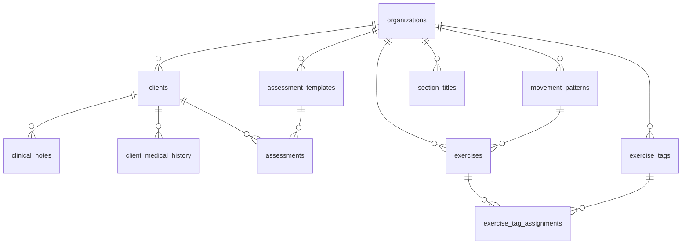
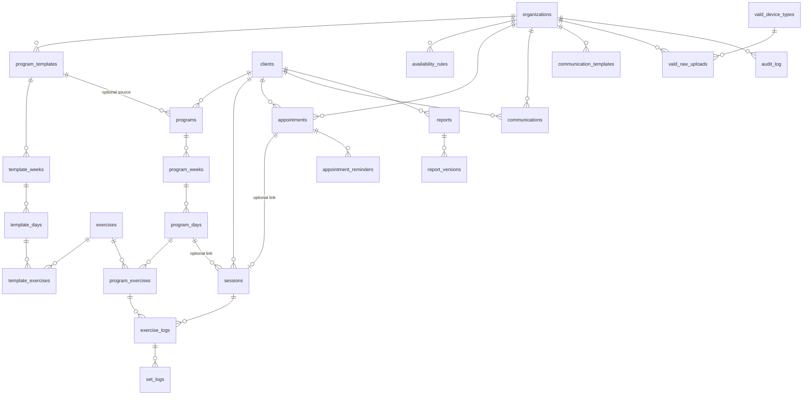

# Schema Design Document

**Project:** Client Platform — EP clinical + programming SaaS
**Version:** 0.2 (Gate 1 review — revised after self-review)
**Date:** 2026-04-20
**Status:** Awaiting IT-advisor review. No migrations will be written until this document is approved.

**Changelog v0.1 → v0.2:**
- Added §6 Foreign-key cascade decisions per FK (was a gap).
- Redesigned clinical note visibility — removed the `visible_to_client` boolean; clinical notes are staff-only always.
- Added §5.4 Cross-organization FK enforcement via trigger function.
- Added §5.5 JWT custom claim mechanism (Supabase Custom Access Token Hook).
- Added §7.4 Client read path via SECURITY DEFINER functions, with a worked example.
- Added §8 Concrete DDL for load-bearing tables.
- Added §11.4 Wide-row handling in audit log.
- Added §12 Concurrency control with explicit `version` column.
- Added §13 Bootstrap and signup flow.
- Added §17 Column-level encryption posture.
- Tightened §9 Indexing with per-index justification.
- Added §10.3 "Last activity" definition for retention clock.
- Added `appointment_reminders` as a dedicated table (was `jsonb` on `appointments`).
- Added aggressive 50-org scale scenario in §16.
- Replaced `vald_device_type` enum with a lookup table.
- Added search indexes on `clients`.
- Fixed Mermaid cardinality on user→client relationship.

---

## 0. How to read this document

This is the **complete database design** before any migrations are written. It is designed to be reviewed by an IT advisor with no prior exposure to the codebase. Every non-trivial decision carries a **Reversibility** note: how painful it is to change later.

Structure:

| §  | Section |
|----|---|
| 1  | Context and non-negotiables |
| 2  | Shift from existing Prisma scaffolding |
| 3  | Entity list |
| 4  | Relationship diagrams |
| 5  | Multi-tenancy model (incl. JWT claim mechanism) |
| 6  | Foreign-key cascade decisions |
| 7  | Row-Level Security (incl. SECURITY DEFINER client read paths) |
| 8  | Concrete DDL for load-bearing tables |
| 9  | Indexing strategy with per-index justification |
| 10 | Soft-delete and retention (incl. "last activity" definition) |
| 11 | Audit log design (incl. wide-row handling) |
| 12 | Concurrency control |
| 13 | Bootstrap and signup flow |
| 14 | Enum vs lookup table decisions |
| 15 | JSONB column justification |
| 16 | Expected row counts — base and aggressive |
| 17 | Column-level encryption posture |
| 18 | Reversibility register |
| 19 | Open questions for review |
| 20 | What is explicitly NOT in this schema |
| 21 | Next steps |

---

## 1. Context and non-negotiables

Fixed inputs, not decisions this document makes:

- **Supabase (Postgres 15+ / Auth / Storage / RLS) in `ap-southeast-2`** (Sydney). Privacy Act 1988 data sovereignty.
- **Multi-tenant from commit one.** Single-tenant UI in v1; every tenant-owned table carries `organization_id`.
- **RLS is the security boundary, not application code.** Every tenant-owned table has explicit `SELECT`, `INSERT`, `UPDATE`, `DELETE` policies.
- **Supabase Auth** owns authentication. Role and org membership live in our schema, surfaced to RLS via a JWT custom claim hook.
- **Soft-delete for all PHI.** 7-year retention for adults; until age 25 for minors at time of last activity.
- **Audit logging at the database level via triggers.** Application-level logging is a supplement, not the source of truth.
- **No Prisma, no ORM magic.** Schema authored in SQL; TypeScript types generated from the live schema via `supabase gen types`.
- **Supabase Pro from launch.** Free tier does not provide the backup guarantees a clinical system requires.

Any change that contradicts one of these is a **foundation migration**, reviewed in the same way this document is being reviewed.

---

## 2. Shift from existing Prisma scaffolding

The repo contains `client-platform/prisma/schema.prisma` (Prisma + Clerk). That scaffolding must be retired before applying migrations for this schema:

| Existing | This schema | Reason |
|---|---|---|
| Prisma ORM | Raw SQL migrations + Supabase query builder | Prisma rewrites queries in ways that conflict with RLS and hide inefficiencies |
| Clerk (`clerkId` fields) | Supabase Auth (`auth.users.id`) | One auth provider; one security story |
| `practices` root | `organizations` root | SaaS-generic naming, aligns with multi-tenant terminology |
| `reps`, `rest`, `load` as `String?` | Typed columns with CHECK constraints | Database enforces invariants; no garbage data |
| Application-level audit model | DB trigger–based `audit_log` with `jsonb` snapshots | Triggers cannot be forgotten; application code can |
| No `program_weeks` — days directly on program | Explicit `program_weeks` table | Week-by-week progression within a mesocycle (TrainHeroic pattern) |
| `reports.tags String[]` | Junction table against a lookup | Tag renames don't require updating every row |
| `clinical_notes.visible_to_client boolean` (v0.1 of this doc) | Removed — clinical_notes are staff-only always | Prevents accidental exposure of clinical reasoning when EP "publishes" a note (see §7.3 & §19) |

**Recommended action once this document is approved:** delete `client-platform/prisma/`, delete `client-platform/src/generated/`, remove `@prisma/*`, `prisma`, and `@clerk/*` from `package.json`, and start `supabase/migrations/` clean. I will not execute this until you say so. Your call whether to archive the Prisma tree to a branch.

> **Reversibility (Prisma → Supabase): moderate.** UI shells and route structure can remain. Data access code must be rewritten. No production data exists yet, so no data loss.

---

## 3. Entity list

33 tables covering Phase 1 (Cliniko replacement) plus minimal scaffolding for Phase 3 (VALD reports). Phase 2 and Phase 4 tables are explicitly deferred (§20).

### 3.1 Identity and tenancy

| Table | Purpose |
|---|---|
| `organizations` | Tenant root. One row per clinical practice business entity. |
| `user_profiles` | Per-user profile data complementing `auth.users`. Stable target for FKs from business tables. |
| `user_organization_roles` | Join table linking `auth.users` to an organization with a role (`owner`, `staff`, `client`). |

### 3.2 Clinical core

| Table | Purpose |
|---|---|
| `clients` | Clinical record for a person in care. May or may not have a linked auth user. |
| `client_medical_history` | Structured static medical history items (conditions, medications, past surgeries). |
| `clinical_notes` | Staff-only SOAP-structured progress notes, injury flags, contraindications. Audit-logged. Never visible to clients. |
| `assessment_templates` | Tenant-configurable assessment forms (initial intake, return-to-play, etc.). |
| `assessments` | A completed assessment for a client, keyed to a template. Responses in `jsonb` per the template schema. |

### 3.3 Exercise library

| Table | Purpose |
|---|---|
| `movement_patterns` | Tenant-configurable movement-pattern taxonomy (Push, Pull, Squat, Hinge, Carry, Core, Isometric). |
| `exercise_tags` | Tenant-configurable tags (DGR, PRI, Rehab, Prehab, ...). |
| `exercises` | One row per exercise. Default prescription + coaching cues + YouTube link. |
| `exercise_tag_assignments` | Many-to-many between `exercises` and `exercise_tags`. |
| `section_titles` | Tenant-configurable per-exercise section labels (Mobility, Strength, Hypertrophy, ...). |

### 3.4 Program engine

| Table | Purpose |
|---|---|
| `program_templates` | Reusable protocol header (ACL Rehab Phase 2, General Strength 3x/wk, ...). |
| `template_weeks` | Week containers within a template. |
| `template_days` | Training days within a template week (Day A, Day B, Day C). |
| `template_exercises` | Exercise prescriptions within a template day. |
| `programs` | Client-specific active program. May be cloned from a template; diverges independently. |
| `program_weeks` | Week containers within a client program. |
| `program_days` | Training days within a program week. |
| `program_exercises` | Per-client exercise prescriptions (may override exercise defaults). |

### 3.5 Session logging

| Table | Purpose |
|---|---|
| `sessions` | One row per completed training session by a client. Session-level RPE and subjective note. |
| `exercise_logs` | One row per exercise performed within a session (per-exercise RPE and notes). |
| `set_logs` | One row per set performed within an exercise log (actual weight, reps, optional metric). |

### 3.6 Scheduling

| Table | Purpose |
|---|---|
| `availability_rules` | EP availability windows — recurring weekly or one-off. |
| `appointments` | A booking between a client and a staff member at a specific start/end time. |
| `appointment_reminders` | One row per reminder sent (email 24h, SMS 24h, confirmation). Provider metadata + delivery lifecycle. |

### 3.7 Communications

| Table | Purpose |
|---|---|
| `communication_templates` | Reusable email/SMS templates with variable placeholders. |
| `communications` | Log of every email or SMS sent to or about a client. |

### 3.8 Reports (Phase 3 scaffolding only)

| Table | Purpose |
|---|---|
| `reports` | Metadata for a rendered performance report. Rendered HTML lives in Supabase Storage, referenced by `storage_path`. |
| `report_versions` | Successive renderings of a report as formats evolve. Immutable once written. |
| `vald_raw_uploads` | Raw CSV/XML payloads uploaded from VALD devices, pre-parse. `payload jsonb`. |
| `vald_device_types` | Lookup table (`forcedecks`, `nordbord`, `forceframe`, `dynamo`). Tenant-configurable for future extensibility. |

### 3.9 Reference and audit

| Table | Purpose |
|---|---|
| `client_categories` | Tenant-configurable client category taxonomy. |
| `audit_log` | Single append-only table. One row per mutation on any audited table. |

**Total: 34 tables.** (v0.1 had 33; `appointment_reminders` and `vald_device_types` added; `visible_to_client` removed from `clinical_notes`.)

---

## 4. Relationship diagrams

Split across three diagrams for legibility. Arrows point from child → parent.

### 4.1 Identity and tenancy

```mermaid
erDiagram
    organizations ||--o{ user_organization_roles : "members"
    auth_users ||--o{ user_organization_roles : "memberships"
    auth_users ||--|| user_profiles : "1:1 mirror"
    user_profiles ||--o{ clients : "portal login (optional)"
    organizations ||--o{ clients : "owns"

    organizations {
        uuid id PK
        text name
        text slug
        text timezone
        timestamptz deleted_at
    }
    user_profiles {
        uuid user_id PK_FK
        text first_name
        text last_name
        text phone
        timestamptz deleted_at
    }
    user_organization_roles {
        uuid id PK
        uuid user_id FK
        uuid organization_id FK
        text role
    }
    clients {
        uuid id PK
        uuid organization_id FK
        uuid user_id FK "nullable"
        text first_name
        text last_name
        date dob
        timestamptz deleted_at
    }
```

### 4.2 Clinical core + exercise library



### 4.3 Programs, sessions, scheduling, comms, reports



---

## 5. Multi-tenancy model

### 5.1 Tenant root

`organizations` is the tenant root. Every other tenant-owned table has `organization_id uuid NOT NULL REFERENCES organizations(id)`.

### 5.2 Which tables carry `organization_id` directly

**All tenant-owned tables except these nested rows:**

| Table | Parent that carries `organization_id` |
|---|---|
| `template_weeks` | `program_templates` |
| `template_days` | `template_weeks` → `program_templates` |
| `template_exercises` | `template_days` → ... |
| `program_weeks` | `programs` |
| `program_days` | `program_weeks` → `programs` |
| `program_exercises` | `program_days` → ... |
| `set_logs` | `exercise_logs` → `sessions` |
| `exercise_tag_assignments` | `exercises` (and `exercise_tags`) |
| `appointment_reminders` | `appointments` |
| `report_versions` | `reports` |

All others store `organization_id` directly for cheap RLS comparisons.

### 5.3 Denormalization trade-off

Nested tables (above) do NOT store `organization_id`. RLS policies walk up the parent chain via `EXISTS`/join. Cost: one or two extra lookups per access. Benefit: no risk of the child's `organization_id` drifting from its parent's.

For hot-path tables — `program_exercises` (projected 1.1M rows base / 11M aggressive by year 3) — the join cost matters. Index coverage (§9) mitigates this: the parent chain's primary keys and FKs are indexed, so the optimizer should use index-only scans for the RLS check.

> **Reversibility (denormalize vs join): easy.** Add `organization_id`, backfill, update RLS. Migration measured in hours, not days.

### 5.4 Cross-organization FK enforcement

An FK with a `REFERENCES` clause does not enforce that the referenced row belongs to the same tenant as the referring row. Example: a `program_exercises` row could reference an `exercise_id` in org A while its parent program is in org B. This is a gap only a CHECK or trigger can close.

**CHECK constraints cannot reference other tables** in Postgres. So we use a generic BEFORE INSERT/UPDATE trigger function.

**Pattern.** A generic PL/pgSQL function invoked via `CREATE TRIGGER` on each cross-org-risky FK:

```sql
CREATE FUNCTION enforce_same_org_fk(
  referenced_table regclass,
  referenced_id uuid,
  self_org_id uuid
) RETURNS void
LANGUAGE plpgsql STABLE AS $$
DECLARE
  ref_org_id uuid;
BEGIN
  EXECUTE format(
    'SELECT organization_id FROM %s WHERE id = $1',
    referenced_table
  ) INTO ref_org_id USING referenced_id;

  IF ref_org_id IS DISTINCT FROM self_org_id THEN
    RAISE EXCEPTION 'Cross-organization FK: % in org % cannot reference % in org %',
      TG_TABLE_NAME, self_org_id, referenced_table, ref_org_id;
  END IF;
END;
$$;
```

Applied via per-table triggers for every FK that crosses a logical boundary:

| From table | FK column | References | Self-org resolved via |
|---|---|---|---|
| `template_exercises` | `exercise_id` | `exercises` | Walk up to `program_templates.organization_id` |
| `program_exercises` | `exercise_id` | `exercises` | Walk up to `programs.organization_id` |
| `programs` | `template_id` | `program_templates` | `programs.organization_id` |
| `exercise_tag_assignments` | `exercise_id`, `tag_id` | `exercises`, `exercise_tags` | Both parents must share org |
| `assessments` | `template_id` | `assessment_templates` | `assessments.organization_id` |
| `appointments` | `client_id`, `staff_user_id` | `clients`, `user_organization_roles` | `appointments.organization_id` |

Each trigger is a single-purpose guard: it executes the check in a few microseconds per write and pays off as a structural security invariant.

### 5.5 JWT custom claim mechanism

RLS policies reference `auth.user_organization_id()`. For that helper to work, the JWT must carry `organization_id` as a custom claim. Supabase does not do this by default — we configure a **Custom Access Token Hook**.

**Hook function (runs at every JWT issue/refresh):**

```sql
CREATE SCHEMA IF NOT EXISTS auth_hooks;

CREATE FUNCTION auth_hooks.custom_access_token(event jsonb)
RETURNS jsonb
LANGUAGE plpgsql STABLE AS $$
DECLARE
  claims jsonb := COALESCE(event->'claims', '{}'::jsonb);
  user_id_val uuid := (event->>'user_id')::uuid;
  active_org uuid;
  active_role text;
BEGIN
  -- v1: exactly one org per user. Phase 4: app selects an active org pre-login.
  SELECT organization_id, role
  INTO active_org, active_role
  FROM public.user_organization_roles
  WHERE user_id = user_id_val
  ORDER BY created_at ASC
  LIMIT 1;

  IF active_org IS NOT NULL THEN
    claims := jsonb_set(claims, '{organization_id}', to_jsonb(active_org::text));
    claims := jsonb_set(claims, '{user_role}',       to_jsonb(active_role));
  END IF;

  RETURN jsonb_set(event, '{claims}', claims);
END;
$$;

GRANT USAGE ON SCHEMA auth_hooks TO supabase_auth_admin;
GRANT EXECUTE ON FUNCTION auth_hooks.custom_access_token(jsonb) TO supabase_auth_admin;
```

**Wiring:** enabled in Supabase dashboard at **Authentication → Hooks → Custom Access Token** pointing at `auth_hooks.custom_access_token`.

**RLS helpers that read the claim:**

```sql
CREATE OR REPLACE FUNCTION auth.user_organization_id() RETURNS uuid
LANGUAGE sql STABLE PARALLEL SAFE AS $$
  SELECT NULLIF(
    current_setting('request.jwt.claims', true)::jsonb ->> 'organization_id',
    ''
  )::uuid
$$;

CREATE OR REPLACE FUNCTION auth.user_role() RETURNS text
LANGUAGE sql STABLE PARALLEL SAFE AS $$
  SELECT current_setting('request.jwt.claims', true)::jsonb ->> 'user_role'
$$;
```

**Safety properties:**
1. `current_setting(..., true)` returns NULL if the claim is absent, not an error.
2. An RLS policy comparing `organization_id = auth.user_organization_id()` with a NULL on the right evaluates to NULL (not TRUE) — no rows match. Fails safe.
3. The JWT is signed by Supabase; a user cannot forge claims. An expired JWT fails validation before RLS runs.

**Phase 4 multi-org flow (documented now to avoid redesign later):** the user lists their orgs, picks one, the app calls a server action that re-issues a session JWT with the chosen org in `claims.organization_id`. This is a session-switch operation, not a multi-claim array.

### 5.6 `auth.user_organization_id()` usage pattern

Every tenant-scoped RLS policy uses one of two idioms:

Direct org column:
```sql
USING (organization_id = auth.user_organization_id())
```

Via parent walk (nested tables):
```sql
USING (
  EXISTS (
    SELECT 1 FROM programs p
    WHERE p.id = program_weeks.program_id
      AND p.organization_id = auth.user_organization_id()
      AND p.deleted_at IS NULL
  )
)
```

Both run index-only when the indexes in §9 are in place.

### 5.7 No global reference data

No table is global (shared across orgs). Every taxonomy is seeded per-organization on signup. This trades a small amount of storage for:
- No copy-on-write ambiguity when a tenant wants to rename "Push" to "Horizontal Push."
- Tenant isolation is total — a bug in global-catalogue editing cannot leak across orgs.

> **Reversibility (introducing a shared catalogue later): moderate.** Requires a nullable `organization_id` with a CHECK that exactly one of (global, tenant-scoped) holds. Avoid until a product need is concrete.

---

## 6. Foreign-key cascade decisions

**Principles:**

1. **PHI is never lost to a FK cascade.** Every FK from a clinical record to a reference (organization, staff user, template) is `ON DELETE RESTRICT` or `ON DELETE SET NULL`. Never `CASCADE`.
2. **Ownership trees cascade on hard delete.** A template's weeks/days/exercises, a program's weeks/days/exercises, a session's logs — these are private children of their parent. When the parent is *hard* deleted, children go.
3. **Soft deletes do NOT trigger FK cascades.** `ON DELETE CASCADE` fires only on true DELETE. For `UPDATE deleted_at = now()` we use application-layer cascade via service code, NOT triggers, because cascading soft-delete is a business rule (retention) not a referential rule.
4. **FKs target stable tables, not `auth.users`.** Where a business record needs to record an actor (author, creator, assigned staff), the FK points to `user_profiles.user_id` — our table, under our soft-delete control. Only `user_profiles.user_id` itself FKs `auth.users(id)` with `ON DELETE CASCADE` as a mirror.
5. **Default is RESTRICT.** When in doubt, RESTRICT. Loud failure beats silent loss.

### 6.1 Cascade table

| From (child) | Column | To (parent) | ON DELETE | Why |
|---|---|---|---|---|
| `user_profiles` | `user_id` | `auth.users(id)` | CASCADE | Profile is a 1:1 mirror of the auth user; if Supabase deletes the auth row, our row has no meaning. |
| `user_organization_roles` | `user_id` | `user_profiles(user_id)` | RESTRICT | Hard-deleting a profile should not silently remove memberships; we soft-delete profiles. |
| `user_organization_roles` | `organization_id` | `organizations(id)` | RESTRICT | Even during org wind-down, memberships are part of the audit trail until retention expires. |
| `clients` | `organization_id` | `organizations(id)` | RESTRICT | PHI must survive org operations; hard-delete is a service-role ritual. |
| `clients` | `user_id` | `user_profiles(user_id)` | SET NULL | If a client's portal account is removed, the clinical record remains unlinked but intact. |
| `client_medical_history` | `client_id` | `clients(id)` | RESTRICT | PHI — hard-delete requires explicit cleanup. |
| `client_medical_history` | `organization_id` | `organizations(id)` | RESTRICT | — |
| `clinical_notes` | `client_id` | `clients(id)` | RESTRICT | — |
| `clinical_notes` | `organization_id` | `organizations(id)` | RESTRICT | — |
| `clinical_notes` | `author_user_id` | `user_profiles(user_id)` | RESTRICT | Don't lose authorship; if staff leaves, soft-delete the profile but keep notes intact. |
| `assessment_templates` | `organization_id` | `organizations(id)` | RESTRICT | — |
| `assessments` | `client_id` | `clients(id)` | RESTRICT | PHI. |
| `assessments` | `template_id` | `assessment_templates(id)` | RESTRICT | Can't hard-delete a template in use. |
| `assessments` | `organization_id` | `organizations(id)` | RESTRICT | — |
| `exercises` | `organization_id` | `organizations(id)` | RESTRICT | — |
| `exercises` | `movement_pattern_id` | `movement_patterns(id)` | RESTRICT | Pattern referenced by exercises cannot be hard-deleted. |
| `exercises` | `created_by_user_id` | `user_profiles(user_id)` | SET NULL | Library entries survive practitioner departures. |
| `exercise_tags` | `organization_id` | `organizations(id)` | RESTRICT | — |
| `movement_patterns` | `organization_id` | `organizations(id)` | RESTRICT | — |
| `section_titles` | `organization_id` | `organizations(id)` | RESTRICT | — |
| `client_categories` | `organization_id` | `organizations(id)` | RESTRICT | — |
| `exercise_tag_assignments` | `exercise_id` | `exercises(id)` | CASCADE | Pure join row; cannot exist without its exercise. |
| `exercise_tag_assignments` | `tag_id` | `exercise_tags(id)` | CASCADE | Same. |
| `program_templates` | `organization_id` | `organizations(id)` | RESTRICT | — |
| `program_templates` | `created_by_user_id` | `user_profiles(user_id)` | SET NULL | Templates outlive practitioners. |
| `template_weeks` | `template_id` | `program_templates(id)` | CASCADE | Template's private tree. |
| `template_days` | `template_week_id` | `template_weeks(id)` | CASCADE | Same. |
| `template_exercises` | `template_day_id` | `template_days(id)` | CASCADE | Same. |
| `template_exercises` | `exercise_id` | `exercises(id)` | RESTRICT | Can't hard-delete an exercise referenced by a template. |
| `programs` | `client_id` | `clients(id)` | RESTRICT | PHI. |
| `programs` | `organization_id` | `organizations(id)` | RESTRICT | — |
| `programs` | `template_id` | `program_templates(id)` | SET NULL | Source template may be retired without damaging active programs. |
| `programs` | `created_by_user_id` | `user_profiles(user_id)` | SET NULL | — |
| `program_weeks` | `program_id` | `programs(id)` | CASCADE | Program's private tree. |
| `program_days` | `program_week_id` | `program_weeks(id)` | CASCADE | Same. |
| `program_exercises` | `program_day_id` | `program_days(id)` | CASCADE | Same. |
| `program_exercises` | `exercise_id` | `exercises(id)` | RESTRICT | — |
| `sessions` | `client_id` | `clients(id)` | RESTRICT | PHI. |
| `sessions` | `organization_id` | `organizations(id)` | RESTRICT | — |
| `sessions` | `program_day_id` | `program_days(id)` | SET NULL | Program edits don't destroy session history. |
| `sessions` | `appointment_id` | `appointments(id)` | SET NULL | Appointment deletions don't destroy session history. |
| `exercise_logs` | `session_id` | `sessions(id)` | CASCADE | Orphan logs have no meaning. |
| `exercise_logs` | `program_exercise_id` | `program_exercises(id)` | SET NULL | Prescription changes don't destroy logs. |
| `set_logs` | `exercise_log_id` | `exercise_logs(id)` | CASCADE | Same. |
| `availability_rules` | `organization_id` | `organizations(id)` | RESTRICT | — |
| `availability_rules` | `staff_user_id` | `user_profiles(user_id)` | CASCADE | Rules are attached to a specific staff member; removal removes the rules. |
| `appointments` | `organization_id` | `organizations(id)` | RESTRICT | — |
| `appointments` | `client_id` | `clients(id)` | RESTRICT | PHI. |
| `appointments` | `staff_user_id` | `user_profiles(user_id)` | RESTRICT | Historical bookings retain staff link. |
| `appointment_reminders` | `appointment_id` | `appointments(id)` | CASCADE | Reminders are the appointment's private children. |
| `communications` | `client_id` | `clients(id)` | RESTRICT | PHI. |
| `communications` | `organization_id` | `organizations(id)` | RESTRICT | — |
| `communications` | `sender_user_id` | `user_profiles(user_id)` | RESTRICT | Preserve sender identity. |
| `communication_templates` | `organization_id` | `organizations(id)` | RESTRICT | — |
| `communication_templates` | `created_by_user_id` | `user_profiles(user_id)` | SET NULL | — |
| `reports` | `client_id` | `clients(id)` | RESTRICT | PHI. |
| `reports` | `organization_id` | `organizations(id)` | RESTRICT | — |
| `report_versions` | `report_id` | `reports(id)` | CASCADE | Private children. |
| `vald_raw_uploads` | `organization_id` | `organizations(id)` | RESTRICT | — |
| `vald_raw_uploads` | `uploaded_by_user_id` | `user_profiles(user_id)` | RESTRICT | Preserve upload provenance. |
| `vald_raw_uploads` | `device_type_id` | `vald_device_types(id)` | RESTRICT | — |
| `audit_log` | `organization_id` | `organizations(id)` | RESTRICT | Audit log is never lost. |
| `audit_log` | `actor_user_id` | — (no FK) | — | Audit log is append-only and must survive user deletion without breaking referential integrity. |

### 6.2 Cascade safety net

To catch any missed entry: a database-wide `pg_constraint` inspection test (pgTAP) asserts that **no FK targeting a PHI table has `ON DELETE CASCADE`**. The test lists excluded pairs (the private-tree cascades above) and fails the CI build if any new FK violates the invariant. Written at Gate 3.

> **Reversibility (cascade decisions): moderate.** Changing a cascade rule requires `ALTER TABLE DROP CONSTRAINT ... ADD CONSTRAINT ...` with a brief lock. Painful at scale but routine pre-launch.

---

## 7. Row-Level Security

### 7.1 Actors

- **owner** — created the organization. In v1, identical operational permissions to staff plus the ability to invite staff and hard-delete the organization.
- **staff** — practitioner with access to all clients within their org.
- **client** — end user of the portal. Sees only their own data within their org.
- **service role** — Supabase service key, used only by server-side code for bootstrap operations that legitimately bypass RLS (signup flow, retention purge, audit log shipping). Never exposed to the browser.

### 7.2 Deletion policy

- Staff NEVER hard-delete PHI. All DELETE policies for PHI tables restrict to service role. Staff soft-delete via `UPDATE deleted_at = now()`.
- Soft-deleted rows are filtered from default SELECTs. An "archive view" (staff-only) shows them within the retention window.
- Hard-delete is a service-role operation executed by a signed server action, logged to `audit_log` before deletion.

### 7.3 Policies per table — plain English

#### `organizations`
- **SELECT:** users see orgs they belong to (via `user_organization_roles`).
- **INSERT:** service role only (signup flow).
- **UPDATE:** owner only, for their own org.
- **DELETE:** service role only.

#### `user_profiles`
- **SELECT:** a user sees their own profile; staff see profiles of users who share their org.
- **INSERT:** trigger-created when `auth.users` row appears (service role).
- **UPDATE:** a user updates their own profile.
- **DELETE:** service role only.

#### `user_organization_roles`
- **SELECT:** a user sees their own memberships; staff see memberships within their org.
- **INSERT:** owner creates any membership in their org; staff create `role='client'` memberships in their org (used by the invite flow).
- **UPDATE:** owner only.
- **DELETE:** owner only. Triggers soft-delete of related client record if applicable.

#### `clients`
- **SELECT:** staff see all non-deleted clients in their org; a client sees only their own row.
- **INSERT:** staff create client records in their org.
- **UPDATE:** staff update any field; clients update a narrow allowlist (phone, emergency contact) enforced in application code, not RLS — RLS for clients on clients is `UPDATE` denied at the DB level to eliminate the risk class entirely. Self-service profile edits route through a server action that uses the service role.
- **DELETE:** staff soft-delete (UPDATE `deleted_at`). Hard DELETE service role only.

#### `client_medical_history`
- **SELECT:** staff within org; client sees their own (shared with them at intake).
- **INSERT/UPDATE/DELETE:** staff only.

#### `clinical_notes`
- **SELECT:** staff within org **only**. Clients NEVER read from this table. (See §19 open question — this is a deliberate v0.2 revision from v0.1's `visible_to_client` boolean.)
- **INSERT:** staff only.
- **UPDATE:** staff only, with optimistic concurrency via `version` column (§12).
- **DELETE:** staff soft-delete. Hard DELETE service role only.

#### `assessment_templates`
- **SELECT/INSERT/UPDATE/DELETE:** staff within org. Not readable by clients.

#### `assessments`
- **SELECT:** staff within org. Client visibility deferred to Phase 2 (assessments are not in the v1 portal UI). RLS denies client SELECT.
- **INSERT/UPDATE:** staff within org.
- **DELETE:** staff soft-delete; hard DELETE service role only.

#### `exercises`
- **SELECT:** staff within org. **Clients do NOT have SELECT on `exercises`.** Client access to exercise details goes through the SECURITY DEFINER function described in §7.4.
- **INSERT/UPDATE/DELETE:** staff within org (soft-delete only for DELETE).

#### `exercise_tags`, `movement_patterns`, `section_titles`, `client_categories`, `exercise_tag_assignments`
- **SELECT/INSERT/UPDATE/DELETE:** staff within org. No client access.

#### `program_templates`, `template_weeks`, `template_days`, `template_exercises`
- **SELECT/INSERT/UPDATE/DELETE:** staff within org (via direct org match or parent join). No client access.

#### `programs`
- **SELECT:** staff within org. Client sees their own program where `status IN ('active', 'archived')` (never `draft`).
- **INSERT/UPDATE:** staff within org.
- **DELETE:** staff soft-delete only; hard DELETE service role only.

#### `program_weeks`, `program_days`, `program_exercises`
- **SELECT:** staff within org (parent join). Client sees these if they are children of their own non-draft program (parent join walks programs → clients.user_id = auth.uid()).
- **INSERT/UPDATE/DELETE:** staff within org.

#### `sessions`
- **SELECT:** staff within org. Client sees their own.
- **INSERT:** client creates their own (portal "Begin Session"); staff create on behalf of client.
- **UPDATE:** client updates their own in-progress session (cannot reopen completed); staff update any session in org.
- **DELETE:** staff soft-delete only. Client cannot delete — protects the clinical record.

#### `exercise_logs`, `set_logs`
- **SELECT:** via parent session.
- **INSERT/UPDATE:** client on their own in-progress session; staff anywhere in org.
- **DELETE:** staff soft-delete via parent session cascade (application-layer).

#### `availability_rules`
- **SELECT/INSERT/UPDATE/DELETE:** staff within org. Clients see derived available-slot view, not the rules.

#### `appointments`
- **SELECT:** staff within org. Client sees their own.
- **INSERT:** client books for themselves in their org (slot availability checked in application code). Staff create for any client in their org.
- **UPDATE:** staff update any. Client may set `status = 'cancelled'` on their own appointment; RLS restricts to this single transition via a CHECK on the UPDATE (§7.5).
- **DELETE:** staff soft-delete only.

#### `appointment_reminders`
- **SELECT:** staff within org (via parent join). Clients do NOT see the reminder log — they see the delivered email/SMS in their real inbox.
- **INSERT/UPDATE:** service role (reminder scheduler).
- **DELETE:** never — reminders are part of the communications audit trail.

#### `communications`
- **SELECT:** staff within org. Clients do NOT see this table — they see the actual email/SMS in their inbox.
- **INSERT/UPDATE:** staff within org.
- **DELETE:** soft-delete only.

#### `communication_templates`
- **SELECT/INSERT/UPDATE/DELETE:** staff within org.

#### `reports`, `report_versions`
- **SELECT:** staff within org. Client sees own reports where `is_published = true`.
- **INSERT/UPDATE:** staff within org.
- **DELETE:** soft-delete only.

#### `vald_raw_uploads`, `vald_device_types`
- **SELECT/INSERT/UPDATE/DELETE:** staff within org. No client access.

#### `audit_log`
- **SELECT:** owner only, within their org. Staff cannot read audit logs.
- **INSERT:** triggers only (the function runs `SECURITY DEFINER` and the table itself denies direct INSERT from all non-service roles).
- **UPDATE:** never.
- **DELETE:** never.

### 7.4 Client read paths via SECURITY DEFINER functions

Some client reads cross tables where row-by-row RLS would be expensive or awkward — e.g., showing the client their current session's exercise list needs to join `program_exercises → exercises` and pull exercise names and video URLs. A bare SELECT on `exercises` is denied to clients (§7.3); the function unwraps the join under a controlled contract.

**Pattern.** A `SECURITY DEFINER` function with a narrow, tested contract. Runs as the function owner (service role), but internally constrains rows to `auth.uid()`'s own data.

**Example — fetch exercise prescription for client's active session:**

```sql
CREATE OR REPLACE FUNCTION public.client_get_program_day_exercises(p_program_day_id uuid)
RETURNS TABLE (
  program_exercise_id   uuid,
  sort_order            int,
  section_title         text,
  superset_group_id     uuid,
  exercise_name         text,
  exercise_video_url    text,
  instructions          text,
  sets                  int,
  reps                  text,
  rest_seconds          int,
  rpe                   smallint,
  optional_metric       text,
  optional_value        text
)
LANGUAGE sql
SECURITY DEFINER
STABLE
SET search_path = public, pg_temp
AS $$
  SELECT
    pe.id                                              AS program_exercise_id,
    pe.sort_order,
    pe.section_title,
    pe.superset_group_id,
    e.name                                             AS exercise_name,
    e.video_url                                        AS exercise_video_url,
    COALESCE(pe.instructions, e.instructions)          AS instructions,
    COALESCE(pe.sets, e.default_sets)                  AS sets,
    COALESCE(pe.reps, e.default_reps)                  AS reps,
    COALESCE(pe.rest_seconds, e.default_rest_seconds)  AS rest_seconds,
    COALESCE(pe.rpe, e.default_rpe)                    AS rpe,
    COALESCE(pe.optional_metric, e.default_metric)     AS optional_metric,
    pe.optional_value
  FROM   program_exercises pe
  JOIN   exercises         e  ON e.id = pe.exercise_id
  JOIN   program_days      pd ON pd.id = pe.program_day_id
  JOIN   program_weeks     pw ON pw.id = pd.program_week_id
  JOIN   programs          p  ON p.id  = pw.program_id
  JOIN   clients           c  ON c.id  = p.client_id
  WHERE  pd.id = p_program_day_id
    AND  c.user_id          = auth.uid()
    AND  p.status           IN ('active', 'archived')
    AND  p.deleted_at       IS NULL
    AND  pe.deleted_at      IS NULL
    AND  e.deleted_at       IS NULL;
$$;

REVOKE ALL ON FUNCTION public.client_get_program_day_exercises(uuid) FROM public;
GRANT EXECUTE ON FUNCTION public.client_get_program_day_exercises(uuid) TO authenticated;
```

**Safety properties:**
1. `SECURITY DEFINER` runs as the function owner (service role) but the `WHERE c.user_id = auth.uid()` pins the result set to the caller.
2. `SET search_path` neutralizes search-path injection attacks.
3. The function is the ONLY way a client reaches `exercises.*` fields. If the function has a bug, ONE place to fix.
4. Covered by pgTAP tests proving: (a) a client sees exercises in their own program; (b) a client gets zero rows for another client's program_day_id; (c) soft-deleted programs return zero rows.

**Other SECURITY DEFINER functions to define:**

| Function | Purpose |
|---|---|
| `client_list_program_days(p_program_id uuid)` | Client lists days in their own active program. |
| `client_start_session(p_program_day_id uuid)` | Client creates a `sessions` row with the right scoping. |
| `client_log_set(p_exercise_log_id uuid, p_set_number int, ...)` | Client logs a set, constrained to their own in-progress session. |
| `client_get_reports(p_client_id uuid)` | Client lists their own published reports. |
| `client_available_slots(p_from timestamptz, p_to timestamptz)` | Client views available appointment slots. |
| `staff_create_client_invite(p_org_id uuid, p_email text, ...)` | Staff creates client record + sends Supabase invite. |

These are the full catalogue of bypass paths. Each is testable, each has a narrow contract, each is reviewed separately.

> **Reversibility (SECURITY DEFINER surface): moderate.** Adding/removing functions is routine. The discipline is to resist growing this list — every function is a bypass path.

### 7.5 UPDATE-clause constraints for client actions

Some client UPDATE actions are constrained to a single field transition (e.g., a client cancelling their own appointment can only set `status = 'cancelled'`, not reschedule). This is expressed via a `WITH CHECK` clause on the UPDATE policy:

```sql
CREATE POLICY "client cancels own appointment"
ON appointments
FOR UPDATE
TO authenticated
USING (
  client_id IN (SELECT id FROM clients WHERE user_id = auth.uid())
  AND auth.user_role() = 'client'
  AND status IN ('pending', 'confirmed')
)
WITH CHECK (
  client_id IN (SELECT id FROM clients WHERE user_id = auth.uid())
  AND status = 'cancelled'
  -- no other field changes allowed; enforced by application paying attention to returning set
);
```

True field-level restriction (only `status` and `cancelled_at` may change) is enforced by a BEFORE UPDATE trigger that raises if any other column differs from its OLD value when the actor is a client.

---

## 8. Concrete DDL for load-bearing tables

Type-exact DDL for the most sensitive and most-reviewed tables. Full DDL for all 34 tables lands in the migration files at Gate 3; this section gives the advisor enough to verify shape.

### 8.1 `organizations`

```sql
CREATE TABLE organizations (
  id              uuid         PRIMARY KEY DEFAULT gen_random_uuid(),
  name            text         NOT NULL CHECK (length(trim(name)) BETWEEN 1 AND 200),
  slug            text         NOT NULL UNIQUE CHECK (slug ~ '^[a-z0-9-]{3,63}$'),
  timezone        text         NOT NULL DEFAULT 'Australia/Sydney'
                   CHECK (timezone IN (SELECT name FROM pg_timezone_names)),
  email           text,
  phone           text,
  address         text,
  created_at      timestamptz  NOT NULL DEFAULT now(),
  updated_at      timestamptz  NOT NULL DEFAULT now(),
  deleted_at      timestamptz
);

CREATE INDEX organizations_active_idx
  ON organizations (id) WHERE deleted_at IS NULL;
```

### 8.2 `user_profiles`

```sql
CREATE TABLE user_profiles (
  user_id         uuid         PRIMARY KEY REFERENCES auth.users(id) ON DELETE CASCADE,
  first_name      text         NOT NULL CHECK (length(trim(first_name)) BETWEEN 1 AND 100),
  last_name       text         NOT NULL CHECK (length(trim(last_name))  BETWEEN 1 AND 100),
  phone           text,
  avatar_url      text,
  created_at      timestamptz  NOT NULL DEFAULT now(),
  updated_at      timestamptz  NOT NULL DEFAULT now(),
  deleted_at      timestamptz
);
```

### 8.3 `user_organization_roles`

```sql
CREATE TYPE user_role AS ENUM ('owner', 'staff', 'client');

CREATE TABLE user_organization_roles (
  id                uuid         PRIMARY KEY DEFAULT gen_random_uuid(),
  user_id           uuid         NOT NULL REFERENCES user_profiles(user_id)
                                 ON DELETE RESTRICT,
  organization_id   uuid         NOT NULL REFERENCES organizations(id)
                                 ON DELETE RESTRICT,
  role              user_role    NOT NULL,
  created_at        timestamptz  NOT NULL DEFAULT now(),
  UNIQUE (user_id, organization_id)
);

CREATE INDEX user_organization_roles_user_idx
  ON user_organization_roles (user_id);
CREATE INDEX user_organization_roles_org_idx
  ON user_organization_roles (organization_id);
```

### 8.4 `clients`

```sql
CREATE TABLE clients (
  id                  uuid         PRIMARY KEY DEFAULT gen_random_uuid(),
  organization_id     uuid         NOT NULL REFERENCES organizations(id) ON DELETE RESTRICT,
  user_id             uuid                  REFERENCES user_profiles(user_id) ON DELETE SET NULL,
  first_name          text         NOT NULL CHECK (length(trim(first_name)) BETWEEN 1 AND 100),
  last_name           text         NOT NULL CHECK (length(trim(last_name))  BETWEEN 1 AND 100),
  email               text         NOT NULL CHECK (email ~ '^[^@\s]+@[^@\s]+\.[^@\s]+$'),
  phone               text,
  dob                 date,
  gender              text,
  address             text,
  emergency_contact_name  text,
  emergency_contact_phone text,
  referral_source     text,
  referred_by         text,
  category_id         uuid         REFERENCES client_categories(id) ON DELETE SET NULL,
  goals               text,
  -- computed once at soft-delete time for retention clock (§10.3)
  last_activity_at    timestamptz,
  invited_at          timestamptz,
  onboarded_at        timestamptz,
  archived_at         timestamptz,
  created_at          timestamptz  NOT NULL DEFAULT now(),
  updated_at          timestamptz  NOT NULL DEFAULT now(),
  deleted_at          timestamptz,
  CONSTRAINT clients_dob_sane CHECK (dob IS NULL OR dob BETWEEN '1900-01-01' AND CURRENT_DATE)
);

CREATE UNIQUE INDEX clients_org_email_unique
  ON clients (organization_id, lower(email))
  WHERE deleted_at IS NULL;

CREATE INDEX clients_org_active_idx
  ON clients (organization_id) WHERE deleted_at IS NULL;

CREATE INDEX clients_user_id_idx
  ON clients (user_id) WHERE user_id IS NOT NULL;

-- Search indexes (dashboard "sticky sidebar with all active clients, searchable by name or meta text")
CREATE INDEX clients_name_trgm_idx
  ON clients USING gin ((lower(first_name) || ' ' || lower(last_name)) gin_trgm_ops)
  WHERE deleted_at IS NULL;

CREATE INDEX clients_email_trgm_idx
  ON clients USING gin (lower(email) gin_trgm_ops)
  WHERE deleted_at IS NULL;
```

### 8.5 `clinical_notes`

v0.2 design: staff-only, SOAP-structured, optimistic-concurrency-protected. No `visible_to_client` column.

```sql
CREATE TYPE note_type AS ENUM (
  'initial_assessment', 'progress_note', 'injury_flag',
  'contraindication',   'discharge',     'general'
);

CREATE TABLE clinical_notes (
  id                  uuid         PRIMARY KEY DEFAULT gen_random_uuid(),
  organization_id     uuid         NOT NULL REFERENCES organizations(id) ON DELETE RESTRICT,
  client_id           uuid         NOT NULL REFERENCES clients(id)        ON DELETE RESTRICT,
  author_user_id      uuid         NOT NULL REFERENCES user_profiles(user_id) ON DELETE RESTRICT,
  note_type           note_type    NOT NULL DEFAULT 'progress_note',
  note_date           date         NOT NULL DEFAULT CURRENT_DATE,
  title               text,
  -- SOAP structure — any field may be NULL; at least one must be non-null
  subjective          text,
  objective           text,
  assessment          text,
  plan                text,
  body_rich           text,        -- free-form additions outside SOAP
  -- Injury flag tracking
  flag_body_region    text,
  flag_severity       smallint     CHECK (flag_severity IS NULL OR flag_severity BETWEEN 1 AND 5),
  flag_reviewed_at    timestamptz,
  flag_resolved_at    timestamptz,
  -- Bookkeeping
  is_pinned           boolean      NOT NULL DEFAULT false,
  version             int          NOT NULL DEFAULT 1,  -- §12 optimistic concurrency
  created_at          timestamptz  NOT NULL DEFAULT now(),
  updated_at          timestamptz  NOT NULL DEFAULT now(),
  deleted_at          timestamptz,
  CONSTRAINT clinical_notes_content_present CHECK (
    COALESCE(subjective, objective, assessment, plan, body_rich) IS NOT NULL
  ),
  CONSTRAINT clinical_notes_injury_flag_fields CHECK (
    (note_type = 'injury_flag') OR
    (flag_body_region IS NULL AND flag_severity IS NULL AND flag_reviewed_at IS NULL AND flag_resolved_at IS NULL)
  )
);

CREATE INDEX clinical_notes_client_time_idx
  ON clinical_notes (client_id, created_at DESC) WHERE deleted_at IS NULL;

CREATE INDEX clinical_notes_org_idx
  ON clinical_notes (organization_id) WHERE deleted_at IS NULL;

-- Needs-attention panel: active injury flags per org
CREATE INDEX clinical_notes_active_flags_idx
  ON clinical_notes (organization_id, client_id)
  WHERE note_type = 'injury_flag'
    AND flag_resolved_at IS NULL
    AND deleted_at IS NULL;

-- Full-text search for the EP (v1 uses trigram; upgrade to tsvector if insufficient)
CREATE INDEX clinical_notes_search_trgm_idx
  ON clinical_notes USING gin (
    (lower(COALESCE(subjective,'') || ' ' ||
           COALESCE(objective,'')  || ' ' ||
           COALESCE(assessment,'') || ' ' ||
           COALESCE(plan,'')       || ' ' ||
           COALESCE(body_rich,''))) gin_trgm_ops
  )
  WHERE deleted_at IS NULL;
```

### 8.6 `audit_log`

```sql
CREATE TYPE audit_action AS ENUM ('INSERT', 'UPDATE', 'DELETE');

CREATE TABLE audit_log (
  id                 uuid          PRIMARY KEY DEFAULT gen_random_uuid(),
  organization_id    uuid          NOT NULL REFERENCES organizations(id) ON DELETE RESTRICT,
  table_name         text          NOT NULL,
  row_id             uuid          NOT NULL,
  action             audit_action  NOT NULL,
  actor_user_id      uuid,         -- no FK — actor may be deleted; audit log survives
  actor_role         text,         -- snapshot from JWT at write time
  changed_at         timestamptz   NOT NULL DEFAULT now(),
  old_values         jsonb,        -- truncated for wide fields — see §11.4
  new_values         jsonb,        -- same
  changed_fields     text[],       -- explicit list of columns that differ
  request_id         uuid,         -- correlation from application log
  ip_address         inet,
  user_agent         text,
  body_size_bytes    int           -- observability on row-snapshot growth
);

-- Primary access pattern: owner views recent activity in their org
CREATE INDEX audit_log_org_time_idx
  ON audit_log (organization_id, changed_at DESC);

-- Look up history of a specific row
CREATE INDEX audit_log_row_idx
  ON audit_log (table_name, row_id);

-- Actor investigation ("what did user X do last week")
CREATE INDEX audit_log_actor_idx
  ON audit_log (actor_user_id, changed_at DESC)
  WHERE actor_user_id IS NOT NULL;

-- Deny all direct writes; only triggers (SECURITY DEFINER) may insert
REVOKE INSERT, UPDATE, DELETE ON audit_log FROM PUBLIC, authenticated;
```

### 8.7 `appointment_reminders`

```sql
CREATE TYPE appointment_reminder_type AS ENUM (
  'confirmation_email', 'confirmation_sms',
  'reminder_24h_email', 'reminder_24h_sms'
);

CREATE TYPE appointment_reminder_status AS ENUM (
  'scheduled', 'sent', 'delivered', 'failed', 'bounced', 'cancelled'
);

CREATE TABLE appointment_reminders (
  id                       uuid          PRIMARY KEY DEFAULT gen_random_uuid(),
  appointment_id           uuid          NOT NULL REFERENCES appointments(id) ON DELETE CASCADE,
  reminder_type            appointment_reminder_type   NOT NULL,
  status                   appointment_reminder_status NOT NULL DEFAULT 'scheduled',
  provider                 text          NOT NULL CHECK (provider IN ('resend', 'twilio')),
  provider_message_id      text,
  scheduled_for            timestamptz   NOT NULL,
  sent_at                  timestamptz,
  delivered_at             timestamptz,
  failed_at                timestamptz,
  failure_reason           text,
  retry_count              smallint      NOT NULL DEFAULT 0 CHECK (retry_count BETWEEN 0 AND 5),
  created_at               timestamptz   NOT NULL DEFAULT now(),
  updated_at               timestamptz   NOT NULL DEFAULT now(),
  UNIQUE (appointment_id, reminder_type)
);

-- Scheduler pulls due reminders
CREATE INDEX appointment_reminders_due_idx
  ON appointment_reminders (scheduled_for)
  WHERE status = 'scheduled';

CREATE INDEX appointment_reminders_appointment_idx
  ON appointment_reminders (appointment_id);
```

Other tables (exercises, programs, program_exercises, sessions, appointments, communications, reports, vald_raw_uploads) will follow the same rigor in the migration files. Shape is already implied by §3–§7.

---

## 9. Indexing strategy

**Principles:**
- Every FK indexed.
- Every column referenced by an RLS policy indexed.
- Every column used in a frequent WHERE or ORDER BY indexed.
- Partial indexes where the filter predicate is stable (e.g., `WHERE deleted_at IS NULL`).
- Justify each index by the query it serves.

### 9.1 Why UUIDv4 primary keys

All PKs are `uuid` via `gen_random_uuid()`. Chosen over `bigserial` because:
- Multi-tenancy: IDs are not guessable across tenants.
- Client can compose an ID before the server round-trip (optimistic UI).
- Org merges (Phase 4) introduce no collisions.

Cost: random UUIDs are bad for B-tree locality. Mitigations: (1) `gen_random_uuid()` from `pgcrypto` is fine at our scale; (2) if locality becomes a problem, upgrade to UUIDv7 (time-ordered) via `pg_uuidv7` extension without breaking FKs.

> **Reversibility (UUID → bigserial): painful.** Would re-key every FK. Not revisited without a performance case.

### 9.2 Per-index justification

Format: `index | purpose | query served`.

#### Identity and tenancy

| Index | Purpose | Query served |
|---|---|---|
| `organizations.slug UNIQUE` | Public-facing routing | `GET /o/:slug` |
| `organizations (id) WHERE deleted_at IS NULL` | Filter live orgs cheaply | dashboard org list |
| `user_organization_roles (user_id)` | Resolve a user's memberships | JWT hook + session bootstrap |
| `user_organization_roles (organization_id)` | List members of an org | Staff admin view |
| `user_organization_roles UNIQUE (user_id, organization_id)` | Prevent duplicate memberships | referential integrity |

#### Clients

| Index | Purpose | Query served |
|---|---|---|
| `clients (organization_id) WHERE deleted_at IS NULL` | Core list view | "My clients" |
| `clients UNIQUE (organization_id, lower(email)) WHERE deleted_at IS NULL` | Uniqueness + invite lookup | Invite flow checks existing email |
| `clients (user_id) WHERE user_id IS NOT NULL` | Reverse lookup when a client logs in | JWT hook resolves `client_id` |
| `clients gin ((lower(first_name)||' '||lower(last_name)) gin_trgm_ops) WHERE deleted_at IS NULL` | Fuzzy name search | Dashboard sidebar search |
| `clients gin (lower(email) gin_trgm_ops) WHERE deleted_at IS NULL` | Fuzzy email search | Same |
| `clients (category_id)` | Category filter chips | Dashboard filters |
| `clients (deleted_at) WHERE deleted_at IS NOT NULL` | Retention purge job | nightly cron |

#### Clinical core

| Index | Purpose | Query served |
|---|---|---|
| `clinical_notes (client_id, created_at DESC) WHERE deleted_at IS NULL` | Chronological client timeline | Client profile notes tab |
| `clinical_notes (organization_id) WHERE deleted_at IS NULL` | Tenant-scoped RLS + search | RLS policy |
| `clinical_notes (organization_id, client_id) WHERE note_type='injury_flag' AND flag_resolved_at IS NULL AND deleted_at IS NULL` | Active flags by org | Dashboard needs-attention panel ("injury flags not reviewed in 14 days") |
| `clinical_notes gin (... gin_trgm_ops)` | EP search | Library lookup |
| `client_medical_history (client_id)` | Per-client history list | Profile page |
| `assessment_templates (organization_id)` | List templates | Settings |
| `assessments (client_id, created_at DESC)` | Per-client assessment history | Profile page |

#### Exercise library

| Index | Purpose | Query served |
|---|---|---|
| `exercises (organization_id) WHERE deleted_at IS NULL` | Library list | Library screen |
| `exercises (organization_id, name) WHERE deleted_at IS NULL` | Alphabetical + search prefix | Sort-by-name |
| `exercises (movement_pattern_id)` | Filter by pattern | Library filter chips |
| `exercises gin (lower(name) gin_trgm_ops) WHERE deleted_at IS NULL` | Fuzzy name search | Library search bar + session builder library tab |
| `exercise_tags UNIQUE (organization_id, lower(name))` | Uniqueness + settings | Tag management |
| `exercise_tag_assignments (exercise_id)`, `(tag_id)` | Both sides of the join | filter by tag |

#### Programs

| Index | Purpose | Query served |
|---|---|---|
| `program_templates (organization_id) WHERE deleted_at IS NULL` | Template list | Settings |
| `template_weeks (template_id, week_number)` | Ordered weeks | Template editor |
| `template_days (template_week_id, sort_order)` | Ordered days | Template editor |
| `template_exercises (template_day_id, sort_order)` | Ordered exercises | Template editor |
| `programs (client_id, status) WHERE deleted_at IS NULL` | Active program lookup | Client profile program tab |
| `programs (client_id) WHERE status='active' AND deleted_at IS NULL` | Single-active-program invariant query | UI + invariant check |
| `programs (template_id)` | Report "which programs came from template X" | Template dependency check before delete |
| `program_weeks (program_id, week_number)` | Calendar render | Program calendar |
| `program_days (program_week_id, sort_order)` | Week view | Calendar |
| `program_exercises (program_day_id, sort_order)` | Day view + client session fetch | Session builder + portal |

#### Sessions

| Index | Purpose | Query served |
|---|---|---|
| `sessions (client_id, completed_at DESC) WHERE deleted_at IS NULL` | Session history | Dashboard "recently completed" + client history |
| `sessions (organization_id) WHERE deleted_at IS NULL` | Org-wide activity | Analytics scaffold |
| `sessions (program_day_id)` | Join from program calendar to session dot | Calendar render |
| `sessions (appointment_id)` | Link in-clinic session to appointment | Appointment detail |
| `sessions (client_id) WHERE completed_at IS NULL` | In-progress session (client resumes mid-workout) | Portal home |
| `exercise_logs (session_id)` | Per-session exercise list | Session detail |
| `set_logs (exercise_log_id, set_number)` | Per-exercise set list | Session detail |

#### Scheduling

| Index | Purpose | Query served |
|---|---|---|
| `availability_rules (organization_id, staff_user_id)` | Staff's rules | Settings |
| `availability_rules (organization_id, effective_from, effective_to)` | Date-bounded rule lookup | Slot generation |
| `appointments (organization_id, start_at) WHERE deleted_at IS NULL` | Calendar view | Staff schedule |
| `appointments (staff_user_id, start_at) WHERE deleted_at IS NULL` | Per-staff calendar | Phase 4 multi-practitioner |
| `appointments (client_id, start_at DESC) WHERE deleted_at IS NULL` | Client booking history | Client portal |
| `appointments (start_at) WHERE status IN ('pending','confirmed') AND deleted_at IS NULL` | Reminder scheduler scan | Cron job |
| `appointment_reminders (scheduled_for) WHERE status='scheduled'` | Due-reminder sweep | Reminder cron |

#### Communications

| Index | Purpose | Query served |
|---|---|---|
| `communications (client_id, sent_at DESC)` | Per-client comm log | Profile Comms tab |
| `communications (organization_id, sent_at DESC)` | Org-wide comm monitor | Admin |
| `communication_templates (organization_id) WHERE deleted_at IS NULL` | Template list | Comms composer |

#### Reports / VALD

| Index | Purpose | Query served |
|---|---|---|
| `reports (client_id, test_date DESC) WHERE deleted_at IS NULL` | Client report list sorted by test | Reports tab |
| `reports (organization_id, is_published)` | Published-report counts for dashboard stat | Stat card |
| `report_versions (report_id, version_number)` | Version picker | Report detail |
| `vald_raw_uploads (organization_id, uploaded_at DESC)` | Upload history | Admin import view |
| `vald_raw_uploads (parsed_at) WHERE parsed_at IS NULL` | Parser queue | Background job |

#### Audit

| Index | Purpose | Query served |
|---|---|---|
| `audit_log (organization_id, changed_at DESC)` | Owner activity feed | Admin audit view |
| `audit_log (table_name, row_id)` | "What happened to row X" | Forensic lookup |
| `audit_log (actor_user_id, changed_at DESC) WHERE actor_user_id IS NOT NULL` | "What did user Y do" | Admin audit view |

### 9.3 Full-text search

v1 uses trigram indexes (`gin_trgm_ops`) for fuzzy matching on `exercises.name`, `clients.first_name/last_name/email`, and `clinical_notes` SOAP fields. Upgrade path to `tsvector` + `tsquery` is a generated column plus a GIN index — no data migration needed.

### 9.4 Partitioning

No table is partitioned in v1. `audit_log` is the partitioning candidate; at base projection it hits ~5M rows by year 3 (§16), at aggressive projection ~50M. Partition by `changed_at` monthly once it exceeds 10M rows. Detected via the `/docs/scaling-checklist.md` metrics (Gate 3).

---

## 10. Soft-delete and retention

### 10.1 Tables that soft-delete

All PHI-containing tables and their clinical-adjacent siblings: `organizations`, `clients`, `client_medical_history`, `clinical_notes`, `assessments`, `assessment_templates`, `exercises`, `exercise_tags`, `movement_patterns`, `section_titles`, `client_categories`, `exercise_tag_assignments`, `program_templates`, `template_weeks`, `template_days`, `template_exercises`, `programs`, `program_weeks`, `program_days`, `program_exercises`, `sessions`, `exercise_logs`, `set_logs`, `availability_rules`, `appointments`, `communications`, `communication_templates`, `reports`, `report_versions`, `vald_raw_uploads`.

RLS SELECT policies default-filter `deleted_at IS NULL`. An `archived_*` view (staff-only) reveals soft-deleted rows within retention.

### 10.2 Tables that hard-delete

- `user_profiles` — we soft-delete via `deleted_at`, but the `auth.users` row itself can be Supabase-deleted, which cascades to `user_profiles` (§6).
- `user_organization_roles` — hard delete is how we revoke access. The user's historical activity remains in `audit_log` permanently.
- `audit_log` — never deleted at all (append-only).
- `appointment_reminders` — never deleted; preserves comm audit trail.

### 10.3 "Last activity" definition

The 7-year retention clock starts at the **most recent of** these timestamps, computed at soft-delete time and stored in `clients.last_activity_at`:

- `MAX(clinical_notes.created_at)` for this client
- `MAX(sessions.completed_at)` for this client
- `MAX(appointments.start_at)` for this client where `status = 'completed'`
- `MAX(assessments.created_at)` for this client
- `MAX(communications.sent_at)` for this client
- `COALESCE(clients.onboarded_at, clients.created_at)` as a floor

Drafts and `status='cancelled'` appointments are ignored — the clock tracks completed clinical work.

Computed once during soft-delete via a trigger; recomputed by the retention job if new activity appears on a soft-deleted client (edge case: staff add a late note after the fact).

### 10.4 Retention purge

A nightly Edge Function (Supabase cron) purges soft-deleted rows past their retention window:
- Adult at `last_activity_at`: purge at `last_activity_at + 7 years`.
- Minor at `last_activity_at` (`dob > last_activity_at - 18 years`): purge at `dob + 25 years`.

**Before purge:** write a final `audit_log` entry capturing full row snapshot, mark purge complete, then DELETE. Run history lives in a `retention_purge_runs` table (introduced in Phase 2 when the job is built).

> **Reversibility (soft-delete → hard-delete): painful.** Once purged, gone. Soft-delete is the reversible choice; retention enforcement is a separate business-rule layer.

---

## 11. Audit log design

### 11.1 Schema

See §8.6 for full DDL.

### 11.2 Audited tables

Tables with triggers (PHI or clinical significance):

`clients`, `client_medical_history`, `clinical_notes`, `assessments`, `programs`, `program_weeks`, `program_days`, `program_exercises`, `sessions`, `exercise_logs`, `set_logs`, `appointments`, `appointment_reminders`, `communications`, `reports`, `report_versions`.

Tables NOT audited via triggers (justification):

- `exercises`, `exercise_tags`, `movement_patterns`, `section_titles`, `client_categories` — reference data. An EP changing "Barbell Back Squat" default reps from 10 to 12 is not a regulated event. Application logs suffice.
- `program_templates` and children — template library, not a patient record.
- `user_profiles`, `user_organization_roles` — application-layer structured logs. Supabase's own auth audit covers authentication events.
- `audit_log` itself — append-only.

### 11.3 Trigger pattern

One generic PL/pgSQL function, attached to each audited table:

```sql
CREATE OR REPLACE FUNCTION log_audit_event()
RETURNS trigger
LANGUAGE plpgsql
SECURITY DEFINER
SET search_path = public, pg_temp
AS $$
DECLARE
  org_id        uuid;
  actor_id      uuid   := NULLIF(current_setting('request.actor_user_id', true), '')::uuid;
  actor_role    text   := NULLIF(current_setting('request.actor_role',    true), '');
  req_id        uuid   := NULLIF(current_setting('request.request_id',    true), '')::uuid;
  ip_addr       inet   := NULLIF(current_setting('request.ip_address',    true), '')::inet;
  ua            text   := NULLIF(current_setting('request.user_agent',    true), '');
  old_jsonb     jsonb;
  new_jsonb     jsonb;
  fields_diff   text[];
  body_size     int;
BEGIN
  -- Resolve organization_id from the row (or its parent for nested tables)
  org_id := audit_resolve_org_id(TG_TABLE_NAME, NEW, OLD);

  old_jsonb := audit_trim_row(TG_TABLE_NAME, to_jsonb(OLD));
  new_jsonb := audit_trim_row(TG_TABLE_NAME, to_jsonb(NEW));
  fields_diff := audit_diff_fields(old_jsonb, new_jsonb);
  body_size := octet_length(COALESCE(old_jsonb::text,'')) + octet_length(COALESCE(new_jsonb::text,''));

  INSERT INTO audit_log (
    organization_id, table_name, row_id, action,
    actor_user_id, actor_role, old_values, new_values, changed_fields,
    request_id, ip_address, user_agent, body_size_bytes
  ) VALUES (
    org_id, TG_TABLE_NAME,
    COALESCE(NEW.id, OLD.id),
    TG_OP::audit_action,
    actor_id, actor_role, old_jsonb, new_jsonb, fields_diff,
    req_id, ip_addr, ua, body_size
  );

  RETURN COALESCE(NEW, OLD);
END;
$$;
```

If the application forgets to set the request-level GUCs (`request.actor_user_id` etc.), the mutation is still captured — just with NULL actor context. Defence in depth.

### 11.4 Wide-row handling — `audit_trim_row`

`clinical_notes.body_rich` and similar free-text fields can be 10-30 KB. Copying them into `old_values` + `new_values` for every edit bloats the audit log. `audit_trim_row` truncates known-wide columns:

```sql
CREATE OR REPLACE FUNCTION audit_trim_row(p_table text, p_row jsonb)
RETURNS jsonb
LANGUAGE plpgsql IMMUTABLE AS $$
DECLARE
  trimmed       jsonb := p_row;
  exclusion_col text;
BEGIN
  IF p_row IS NULL THEN RETURN NULL; END IF;
  FOR exclusion_col IN
    SELECT column_name FROM audit_wide_column_config WHERE table_name = p_table
  LOOP
    IF trimmed ? exclusion_col AND
       octet_length(trimmed->>exclusion_col) > 4096 THEN
      trimmed := jsonb_set(
        trimmed,
        ARRAY[exclusion_col],
        to_jsonb(json_build_object(
          '_truncated',  true,
          '_sha256',     encode(digest(trimmed->>exclusion_col, 'sha256'), 'hex'),
          '_size_bytes', octet_length(trimmed->>exclusion_col),
          '_preview',    left(trimmed->>exclusion_col, 500)
        ))
      );
    END IF;
  END LOOP;
  RETURN trimmed;
END;
$$;

CREATE TABLE audit_wide_column_config (
  table_name  text NOT NULL,
  column_name text NOT NULL,
  PRIMARY KEY (table_name, column_name)
);

INSERT INTO audit_wide_column_config VALUES
  ('clinical_notes', 'subjective'),
  ('clinical_notes', 'objective'),
  ('clinical_notes', 'assessment'),
  ('clinical_notes', 'plan'),
  ('clinical_notes', 'body_rich'),
  ('communications', 'body'),
  ('vald_raw_uploads', 'payload');
```

Each truncated field in the audit record carries a SHA-256 and size so we can still prove "did this field change" and "by how much," without storing full copies. Full historical content can be reconstructed from the database backups (Supabase PITR + weekly S3 exports) if legally required.

### 11.5 Storage and external shipping

Supabase retains its own logs 7 days. Our `audit_log` table is backed up with the database (7-day PITR on Pro). For the 7-year retention window, a weekly Edge Function exports `audit_log` rows written since the last export to an S3 bucket in ap-southeast-2 (AES-256, versioned, lifecycle-archived to Glacier after 1 year). Procedure documented in `/docs/disaster-recovery.md` at Gate 3.

### 11.6 Reading the audit log

Owner-only read via RLS. An admin UI (`/admin/audit`) surfaces:
- Recent activity feed (org-scoped, time-descending)
- Row history lookup (given a table + row_id)
- Actor investigation (given a user_id)

No UI writes to `audit_log`. No API writes. Only triggers.

---

## 12. Concurrency control

Tables where two staff members can reasonably edit the same record concurrently get an optimistic-concurrency `version int` column:

- `clinical_notes`
- `programs`, `program_exercises`
- `assessments`
- `clients` (rare but possible during intake editing)

### 12.1 Pattern

```sql
ALTER TABLE clinical_notes
  ADD COLUMN version int NOT NULL DEFAULT 1;

CREATE OR REPLACE FUNCTION bump_version()
RETURNS trigger
LANGUAGE plpgsql AS $$
BEGIN
  NEW.version := OLD.version + 1;
  NEW.updated_at := now();
  RETURN NEW;
END;
$$;

CREATE TRIGGER clinical_notes_bump_version
  BEFORE UPDATE ON clinical_notes
  FOR EACH ROW EXECUTE FUNCTION bump_version();
```

**Client usage.** The application SELECTs `(...fields..., version)`, edits, and UPDATEs with:

```sql
UPDATE clinical_notes
SET subjective = $1, ..., version = version   -- trigger increments
WHERE id = $2 AND version = $3
RETURNING version;
```

If `ROWCOUNT = 0`, a concurrent write won — surface a 409 Conflict to the UI with both versions shown.

### 12.2 Not every table gets this

Session logs, exercise logs, set logs — client-owned in-progress writes. Conflict is impossible (one client, one device at a time in practice). No version needed.

Reference data — edited via settings UI one operator at a time. `updated_at` alone is sufficient.

> **Reversibility (add/remove version columns): easy.** Single ALTER TABLE; application code is the only real cost.

---

## 13. Bootstrap and signup flow

The policy model in §7 has a bootstrap dependency: RLS policies on `user_organization_roles` require a row in `user_organization_roles` to permit further inserts. The first row must be created by a privileged actor.

### 13.1 EP (owner) signup

1. User lands on `/signup`, enters email + password.
2. Supabase Auth creates the `auth.users` row.
3. Trigger on `auth.users` creates a `user_profiles` row (mirror).
4. Client-side redirect to `/onboarding/org`, enters organization name.
5. Server action `create_organization_with_owner(p_org_name text, p_timezone text)` runs with the service role:
   - INSERT `organizations`.
   - INSERT `user_organization_roles (user_id=auth.uid(), organization_id=new_org_id, role='owner')`.
   - Seed default `movement_patterns`, `section_titles`, `client_categories`, `exercise_metric_units`, `vald_device_types` for this org.
6. Supabase re-issues the JWT via the Custom Access Token Hook (§5.5), now carrying `organization_id`.
7. User lands on the dashboard with full RLS context.

All of step 5 runs in a single transaction. If any step fails, the whole operation rolls back — no half-created orgs.

### 13.2 Client invite flow

1. Staff on the clients page clicks "Invite Client" and fills the form.
2. Server action `staff_create_client_invite(p_email text, p_first text, p_last text, ...)`:
   - Verify caller has `role IN ('owner','staff')` for the active org.
   - INSERT `clients` row with `user_id = NULL`, `invited_at = now()`.
   - Call Supabase Auth admin API to send an invite email with a magic link.
   - (Service role used for the admin API call.)
3. Client clicks the magic link.
4. Supabase Auth creates `auth.users`; trigger creates `user_profiles`.
5. Supabase Auth redirects to `/welcome` with a one-time token.
6. Server action `client_accept_invite(p_client_id uuid)`:
   - Verify `auth.users.email` matches `clients.email` for that org.
   - Link: `UPDATE clients SET user_id = auth.uid(), onboarded_at = now() WHERE id = p_client_id`.
   - INSERT `user_organization_roles (user_id, organization_id, role='client')`.
7. JWT re-issued with `organization_id` and `role='client'`.
8. Client lands on `/portal`.

### 13.3 Role revocation

Staff clicks "Archive Client":
- `UPDATE clients SET deleted_at = now(), last_activity_at = <computed>`.
- DELETE `user_organization_roles` for `(client.user_id, client.organization_id)`.
- Optionally trigger password reset to invalidate active sessions.

Clinical record remains soft-deleted; retention clock starts.

---

## 14. Enum vs lookup table decisions

**Rule of thumb:**
- **Enum** when values are system-defined, small, stable, and wired into code logic.
- **Lookup table** when values are tenant-customizable or expected to grow.

### 14.1 Enums

| Enum | Values | Why enum |
|---|---|---|
| `user_role` | `owner`, `staff`, `client` | Wired into RLS policy logic; changing these is a code change. |
| `program_type` | `home_gym`, `in_clinic` | Two values, deeply wired into UI and availability coupling. |
| `program_status` | `draft`, `active`, `archived` | State machine; UI transitions are hardcoded. |
| `appointment_status` | `pending`, `confirmed`, `cancelled`, `completed`, `no_show` | State machine. |
| `note_type` | `initial_assessment`, `progress_note`, `injury_flag`, `contraindication`, `discharge`, `general` | Dashboard triggers (injury flag → needs-attention). |
| `communication_type` | `email`, `sms` | Two values; provider routing. |
| `communication_direction` | `outbound`, `inbound` | Two values. |
| `communication_status` | `draft`, `queued`, `sent`, `delivered`, `failed`, `bounced` | Provider-event state machine. |
| `assessment_status` | `draft`, `completed`, `archived` | State machine. |
| `audit_action` | `INSERT`, `UPDATE`, `DELETE` | DB-level concept. |
| `availability_recurrence` | `weekly`, `one_off` | Two values. |
| `appointment_reminder_type` | `confirmation_email`, `confirmation_sms`, `reminder_24h_email`, `reminder_24h_sms` | Four values; provider routing. |
| `appointment_reminder_status` | `scheduled`, `sent`, `delivered`, `failed`, `bounced`, `cancelled` | Lifecycle. |

> **Reversibility (enum add value): easy.** `ALTER TYPE ADD VALUE`.
> **Reversibility (enum remove value): painful.** Requires type swap + backfill. Add freely; remove via planned migration.

### 14.2 Lookup tables

| Table | Why not an enum |
|---|---|
| `movement_patterns` | Brief says practitioners will customize. Seeded with defaults on org creation. |
| `exercise_tags` | Tenant-defined ("DGR", "PRI", "Rehab", "Prehab" — practitioner-configurable). |
| `section_titles` | Tenant-defined. |
| `client_categories` | Tenant-defined. |
| `exercise_metric_units` | Grows over time (watts, cal/hr for future sports). Also needs display strings and conversion factors. |
| `vald_device_types` | New VALD devices come on market. Lookup table enables add-without-migration. |

---

## 15. JSONB column justification

Per the prompt, every `jsonb` column must justify its variable shape.

| Column | Why jsonb | Alternative rejected |
|---|---|---|
| `audit_log.old_values` / `new_values` | Captures arbitrary row snapshots across 16 tables. | One audit table per audited table (16× duplication). |
| `audit_log.changed_fields text[]` | Variable-length list of field names. | N/A — `text[]` is the right type; not jsonb. |
| `assessment_templates.schema_json` | Form schema is user-defined per template. | EAV schema (verbose, slow). |
| `assessments.responses_json` | Responses follow the template's schema; shape varies. | EAV join table (harder to reason about). |
| `communication_templates.variables_schema` | Template variable manifest varies. | — |
| `vald_raw_uploads.payload` | Raw CSV/XML from different VALD devices. Staging format pre-parse. | Per-device staging tables (premature). |

**Explicitly NOT jsonb:**
- `clinical_notes` SOAP — four `text` fields + optional `body_rich`. Queryable, indexable, searchable.
- Exercise default prescription — stable fields (`default_sets`, `default_reps`, `default_rest_seconds`, `default_rpe`, `default_metric`).
- Reports — rendered HTML in Supabase Storage, referenced by `storage_path text`.
- Program prescription overrides — structured fields, not a bag.
- Appointment reminders — separate table, not `reminder_metadata jsonb` (was v0.1, now v0.2 fixed).

> **Reversibility (jsonb → columns): moderate.** Requires a migration to move top-level keys into new columns. Done per extraction.

---

## 16. Expected row counts

### 16.1 Base scenario — conservative growth

| Assumption | Year 1 | Year 3 |
|---|---|---|
| Organizations | 1 | 5 |
| Active clients per org | 50 | 50 |
| Total clients (active + archived) per org | 200 | 600 |
| Sessions per client per week | 3 | 3 |
| Appointments per client per week | 1 | 1 |
| Exercises per session | 6 | 6 |
| Sets per exercise | 3 | 3 |

| Table | Y1 | Y3 (base) |
|---|---:|---:|
| `organizations` | 1 | 5 |
| `user_profiles` | ~55 | ~1,500 |
| `user_organization_roles` | ~55 | ~1,500 |
| `clients` | 200 | 3,000 |
| `client_medical_history` | ~1,000 | ~15,000 |
| `clinical_notes` | ~2,500 | ~40,000 |
| `exercises` | ~300 | ~1,500 |
| `programs` | ~1,000 | ~15,000 |
| `program_weeks` | ~4,000 | ~60,000 |
| `program_days` | ~12,000 | ~180,000 |
| `program_exercises` | ~72,000 | ~1.1M |
| `sessions` | ~7,800 | ~120,000 |
| `exercise_logs` | ~47,000 | ~700,000 |
| `set_logs` | ~141,000 | ~2.1M |
| `appointments` | ~2,600 | ~40,000 |
| `appointment_reminders` | ~5,000 | ~80,000 |
| `communications` | ~1,200 | ~18,000 |
| `reports` | ~50 | ~1,500 |
| `report_versions` | ~150 | ~5,000 |
| `vald_raw_uploads` | ~50 | ~1,500 |
| `audit_log` | ~500,000 | **~5M** |

### 16.2 Aggressive scenario — SaaS growth hits

Add a 10× organization count by Year 3 (50 orgs instead of 5). Linear scaling of client-level tables; audit_log grows with total mutations.

| Table | Y3 (aggressive) | Note |
|---|---:|---|
| `organizations` | 50 | |
| `clients` | ~30,000 | |
| `clinical_notes` | ~400,000 | |
| `programs` | ~150,000 | |
| `program_exercises` | ~11M | Hot path; RLS policy + index coverage must handle this. |
| `sessions` | ~1.2M | |
| `exercise_logs` | ~7M | |
| `set_logs` | ~21M | **Partitioning candidate if query p95 > 200ms.** |
| `appointments` | ~400,000 | |
| `audit_log` | **~50M** | **Partition by `changed_at` monthly from the start** in aggressive path. |

### 16.3 Partitioning thresholds

- `audit_log`: partition when table exceeds 10M rows. Monitor via `/docs/scaling-checklist.md` (Gate 3).
- `set_logs`: single-table healthy to 100M rows with current indexes. Monitor query p95 latency on session read; partition only if degradation observed.
- All other tables: no partitioning within 3-year horizon at either projection.

### 16.4 Storage

- Base Y3: ~15 GB Postgres footprint.
- Aggressive Y3: ~120 GB Postgres footprint (driven mostly by audit_log).
- Supabase Pro included DB size handles both; no pressure to offload in the 3-year horizon.

---

## 17. Column-level encryption posture

v1 relies on Supabase's default **encryption at rest (AES-256)** plus **TLS 1.3 in transit**. That matches APP 11.1's "reasonable steps" standard for protecting sensitive health information.

**Column-level encryption (via `pgsodium` or `pgcrypto`) is deferred** because:

1. It complicates RLS — encrypted columns cannot be indexed or searched without reveal logic.
2. The key-management overhead (KMS, rotation, envelope encryption) is disproportionate at our current scale.
3. Supabase's `pgsodium` integration is available if a specific audit finding requires it later.

**Revisit trigger:** if a client demands column-level encryption of DOB or emergency contact (uncommon but not unprecedented in allied health), we'll add `pgsodium` on those specific columns with a documented key rotation policy. Not before.

**What is already encrypted today:**
- Disk: AES-256 at Supabase's storage layer.
- Transit: TLS 1.3 end-to-end.
- Backups: encrypted at rest (Supabase) + encrypted at rest (our S3 exports with bucket-level SSE).
- Secrets: Vercel environment variables (HashiCorp Vault-backed), never in git.

> **Reversibility (add column-level encryption later): moderate.** Migration per column; queries touching that column need update. Doable without data loss.

---

## 18. Reversibility register

| Decision | Reversibility | Cost of reversal |
|---|---|---|
| Multi-tenancy from day one | **Painful** | Retrofitting is a rebuild. Kept. |
| Supabase over bare Postgres + self-hosted auth | **Painful** | Would rewrite auth, RLS, storage, functions. Committed. |
| Supabase Auth over Clerk | **Moderate** | Doable before users exist; painful after. |
| Drop Prisma in favour of raw SQL + typed client | **Easy (now), painful (later)** | Do it before any migrations. |
| UUID primary keys | **Painful** | Every FK re-keyed. Not revisited without a perf case. |
| JSONB for assessments, audit log, VALD uploads | **Moderate** | Extraction to columns via migration. |
| Enum types for stable status fields | **Moderate** | ADD VALUE easy; REMOVE requires type swap. |
| Lookup tables for tenant-configurable taxonomies | **Easy** | Edit lookup rows. |
| Soft-delete on PHI with retention purge | **Painful to reverse once purged** | Soft-delete IS the reversible choice. |
| Triggers for audit log | **Easy** | DROP TRIGGER + add app logs. |
| Omit `organization_id` on nested rows | **Easy** | ADD COLUMN + backfill. |
| No read replicas / no Redis / no job queue | **Easy** | Add when metrics justify. |
| Trigram indexes for search (not tsvector) | **Easy** | Add generated column + GIN. |
| No partitioning on `audit_log` in v1 | **Moderate** | Partition-by-range requires migration with downtime window. |
| Rename `practices` → `organizations` | **Easy** | Pre-launch, no data. |
| Clinical notes staff-only (removed `visible_to_client`) | **Easy** | Re-add column via migration if product decides client visibility. |
| Cross-org FK enforcement via triggers | **Easy** | Triggers DROP/CREATE; equivalent to adding a CHECK. |
| JWT custom claim hook for `organization_id` | **Moderate** | Changing the hook signature is a Supabase config change + function redeploy. |
| SECURITY DEFINER functions for client read paths | **Moderate** | Each function is a separate surface; disciplined to keep small. |
| `version int` OCC on selected tables | **Easy** | Add/drop column; app code follows. |
| `appointment_reminders` as a table (vs jsonb) | N/A — pre-launch choice | — |

---

## 19. Open questions for review

Questions I need your and your IT advisor's call on before I write migrations. Each changes the schema if answered differently.

### 19.1 Clinical notes visibility to clients

v0.2 of this document **removed** the `visible_to_client` boolean. Clinical notes are now staff-only always. Rationale: SOAP structure means "publishing" the whole note can leak clinical reasoning the client was not meant to see.

The brief lists "own EP notes visible to client" as a client-portal surface. I'm interpreting this as:
- `programs.notes` — overall program-level message (already client-visible)
- `program_exercises.instructions` — per-exercise coaching cues (already client-visible)
- `exercises.instructions` — default coaching cues (already client-visible via the same path)

If the intent is that clients should also see EP-authored long-form messages (not SOAP notes, not email), we need a separate `client_visible_messages` table. **Confirm my interpretation or redirect.**

### 19.2 Assessments: template-driven or fixed columns?

Chosen in this draft: `assessment_templates.schema_json` defines the form; `assessments.responses_json` holds responses. Flexible, template-driven. Alternative: hard-code the v1 intake as columns on a `client_assessments` table — rigid but fully typed and indexable. **Your call.**

### 19.3 Can a client cancel their own appointment?

Drafted RLS allows client to set `status = 'cancelled'` on their own pending/confirmed appointment. Not rescheduling — that's a staff action. **Confirm or restrict further.**

### 19.4 Per-set or per-exercise RPE?

Modelled per-exercise on `exercise_logs` (matches brief). Optional per-set `rpe` on `set_logs` for future use (autoregulation). **Confirm v1 is per-exercise-only or remove the `set_logs.rpe` column.**

### 19.5 Client self-registration for Phase 4?

Brief says no self-registration. Schema supports it trivially. **Confirm v1 stays invite-only.**

### 19.6 Hard-delete on client right-to-be-forgotten request

Soft-delete with retention purge is the default. If a client invokes the right to be forgotten, hard delete is a manual service-role procedure (documented in `/docs/incident-response.md` at Gate 2), not a UI button. **Confirm.**

### 19.7 Owner vs staff role

`owner` reserved for: invite/remove staff, hard-delete the organization. Otherwise equivalent to staff. In solo-EP v1, owner == staff (the EP holds both). **Confirm or collapse into `staff`.**

### 19.8 Session-to-appointment linkage

`sessions.appointment_id` is nullable. A home session has no appointment; an in-clinic session has one. **Confirm the nullable FK model (vs a separate `in_clinic_sessions` table).**

### 19.9 Assessment visibility to clients

Current policy: clients cannot read `assessments` at all. The client portal does not have an assessments screen in v1. **Confirm — if any client-facing assessment UI emerges, we add a `visible_to_client boolean` with explicit publishing, mirroring the earlier clinical note discussion.**

---

## 20. What is explicitly NOT in this schema

Called out so review knows what is deliberately deferred:

- **AI drafting** (Phase 2) — AI draft history, approval states, prompt templates.
- **Practice analytics** (Phase 4) — retention metrics, revenue tracking, adherence scores.
- **Multi-practitioner UI** (Phase 4) — EP-client assignment tables beyond the generic `user_organization_roles`.
- **Billing / invoicing** — external in v1.
- **In-app messaging / chat** — product says no.
- **Referral source as a lookup table** — free text in v1; low volume.
- **Client goals as a separate table** — `clients.goals text` in v1.
- **Feature flags** — application-level concern.
- **Rate limiting tables** — Supabase's built-in rate limits cover v1.
- **Session builder's superset-group as its own table** — stored as `superset_group_id uuid` on `program_exercises` pointing to a group PK within the same day (self-referencing + group anchor). Groups come and go with the exercises; no separate lifecycle.

---

## 21. Next steps

When this document is approved:

1. I retire the existing Prisma + Clerk scaffolding per your direction (delete vs archive).
2. `/docs/auth.md` — Gate 2 authentication design (signup, invite, password reset, session lifetime, JWT refresh, multi-org switch, rate limiting config).
3. `/docs/rls-policies.md` — Gate 2 plain-English RLS mapping, expanded from §7.
4. `/docs/slos.md` — service-level objectives.
5. `/docs/incident-response.md` — incident runbook including Privacy Act 72-hour breach procedure.
6. Gate 2 review.
7. Gate 3 — migrations, pgTAP tests, disaster-recovery drill.

**No migrations, no code changes, until this document is approved.**
