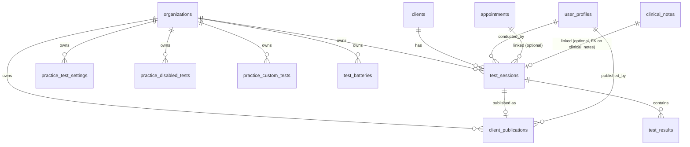

# Testing & Reports Module — Schema Design

**Module:** Physical-marker testing, results capture, per-EP overrides, publish gate.
**Brief:** [`CLAUDE_CODE_BUILD_PROMPT_testing_module.md`](../CLAUDE_CODE_BUILD_PROMPT_testing_module.md)
**Schema source:** [`data/physical_markers_schema_v1.1.json`](../data/physical_markers_schema_v1.1.json)
**Parent docs:** [`schema.md`](schema.md), [`rls-policies.md`](rls-policies.md)
**Version:** 0.1
**Date:** 2026-04-28
**Status:** Awaiting review. **No migrations are written until this document is approved.**

---

## 0. How to read this document

This is the database design for the testing module — the structured per-metric capture layer the brief specifies. It is scoped narrowly: only the new tables, the new view, the new RLS policies, and the changes to existing infrastructure (`audit_resolve_org_id`, `enums.sql`).

It assumes [`schema.md`](schema.md) and [`rls-policies.md`](rls-policies.md) have been read. Conventions there apply unchanged: `organization_id` on every tenant table, soft-delete via `deleted_at`, `enforce_same_org_fk()` for cross-org integrity, OCC `version` on mutation-heavy tables, audit log via trigger.

Every architectural call carries a **Reversibility** note. §14 lists the calls that need explicit sign-off before migrations are written.

Section map:

| §  | Section |
|----|---|
| 1  | Context — what this module does and what it doesn't |
| 2  | Entities introduced |
| 3  | Relationship diagram |
| 4  | Per-table DDL with rationale |
| 5  | Foreign-key cascade decisions |
| 6  | RLS policies |
| 7  | Computed `is_baseline` view and function |
| 8  | Audit log integration |
| 9  | Indexing |
| 10 | JSONB justification |
| 11 | Enum decisions |
| 12 | Concurrency control |
| 13 | Validation bounds (forward reference) |
| 14 | Open questions for review |
| 15 | Reversibility register |
| 16 | Acceptance test mapping |

---

## 1. Context

### 1.1 What this module does

Captures structured per-metric test results (CMJ jump height, KOOS subscale, NordBord peak force, …) into normalised tables, applies per-EP rendering overrides via a runtime resolver, and exposes a publish gate that controls what a client sees in the portal.

### 1.2 What this module does NOT do

Per brief §9 — flagged so the design stays bounded:
- VALD CSV/XML ingestion (Phase 3+). The data layer must accept VALD-sourced sessions later (`source = 'vald'`); the importer is not built here.
- AI-drafted framing text (Phase 2).
- Cross-client analytics.
- The legacy "rendered HTML report" flow — that uses the existing `reports`, `report_versions`, `vald_raw_uploads`, `vald_device_types` tables and is **untouched** by this module. The two flows coexist.

### 1.3 Coexistence with the legacy `reports` table

The legacy `reports` table holds metadata for rendered HTML reports stored in Supabase Storage. It has its own publish gate (`is_published`) and its own RLS. **None of the new tables in this module reference it.** The eventual UX decision to move the legacy report list out of `/portal/reports/` (per the gap doc §4 question 2) does not require schema changes — just a routing change.

### 1.4 The runtime-config rule (load-bearing)

Schema defaults live in `data/physical_markers_schema_v1.1.json`. Per-EP overrides live in `practice_test_settings`. Neither is consulted directly by application code. The resolver `resolveMetricSettings(org, test, metric)` is the single allowed path. This is a **brief §0 requirement** and the architecture is built to enforce it: there is no helper to look up "is this metric `higher`-is-better" except via the resolver.

---

## 2. Entities introduced

Seven tables, one view, one function, two enum sets.

### 2.1 New tables

| Table | Purpose |
|---|---|
| `test_sessions` | One row per (clinician, client, conducted_at). Audited. |
| `test_results` | One row per (test_session, test_id, metric_id, side). Append-only-with-soft-delete. Audited. |
| `practice_test_settings` | Per-(org, test, metric) override of rendering hints. Settings — not audited. |
| `practice_disabled_tests` | Per-(org, test) existence row. Settings — not audited. **(See §14 Q1 — diverges from brief's single-table proposal.)** |
| `practice_custom_tests` | Tests added by the practice (not in the schema). `metrics jsonb`. Settings — not audited. |
| `test_batteries` | Saved sets of metric keys for one-click capture. `metric_keys jsonb`. Settings — not audited. |
| `client_publications` | Publish-gate record per `test_session`. Audited. |

### 2.2 New view + function

| Object | Purpose |
|---|---|
| `test_results_with_baseline` (view) | Same shape as `test_results` plus an `is_baseline` boolean computed via window function. The primary surface for charts. |
| `test_session_is_baseline(session_id, test_id)` (function) | Convenience for inline queries. Returns true if this session is the earliest non-deleted session for the client + test combo. |

### 2.3 New enums

```
direction_of_good_t        : 'higher' | 'lower' | 'target_range' | 'context_dependent'
default_chart_t            : 'line' | 'bar' | 'radar' | 'asymmetry_bar' | 'target_zone'
comparison_mode_t          : 'absolute' | 'bilateral_lsi' | 'vs_baseline' | 'vs_normative'
client_portal_visibility_t : 'auto' | 'on_publish' | 'never'
client_view_chart_t        : 'line' | 'milestone' | 'bar' | 'narrative_only' | 'hidden'
test_source_t              : 'manual' | 'vald' | 'imported'
test_side_t                : 'left' | 'right'   -- NULL is permitted on the column for non-bilateral
```

Each enum mirrors the schema JSON's `rendering_hints` legend exactly.

> **Reversibility (enums): moderate.** Adding a value is `ALTER TYPE … ADD VALUE` — fine. Removing a value requires recreating the type and all dependent columns. This is acceptable because the schema JSON's legend is the source of truth — values change rarely and are review-gated.

---

## 3. Relationship diagram



Key relationships:
- A test session is owned by an organization, performed on a client, conducted by a clinician (`user_profiles.user_id`), optionally linked to an appointment.
- A test result belongs to exactly one test session.
- A clinical note can link to one test session via a new column `clinical_notes.test_session_id` (Phase B work; documented here, migrated then). Per gap doc §4 Q3, this is a single nullable FK — N:M is over-engineered for v1.
- A client publication points to one test session. `UNIQUE (test_session_id) WHERE deleted_at IS NULL` — only one live publication per session.

---

## 4. Per-table DDL

### 4.1 `test_sessions`

The unit of clinical record. Audited.

```sql
CREATE TABLE test_sessions (
  id                uuid             PRIMARY KEY DEFAULT gen_random_uuid(),
  organization_id   uuid             NOT NULL REFERENCES organizations(id) ON DELETE RESTRICT,
  client_id         uuid             NOT NULL REFERENCES clients(id)       ON DELETE RESTRICT,
  conducted_by      uuid             NOT NULL REFERENCES user_profiles(user_id) ON DELETE RESTRICT,
  conducted_at      timestamptz      NOT NULL,
  appointment_id    uuid             REFERENCES appointments(id) ON DELETE SET NULL,
  source            test_source_t    NOT NULL DEFAULT 'manual',
  notes             text,
  version           int              NOT NULL DEFAULT 1,
  created_at        timestamptz      NOT NULL DEFAULT now(),
  updated_at        timestamptz      NOT NULL DEFAULT now(),
  deleted_at        timestamptz,
  CONSTRAINT test_sessions_conducted_at_sane CHECK (
    conducted_at BETWEEN '1900-01-01' AND now() + INTERVAL '1 day'
  ),
  CONSTRAINT test_sessions_notes_length CHECK (
    notes IS NULL OR length(notes) <= 4000
  )
);
```

- **`conducted_by`** is `user_profiles(user_id)`, not `auth.users` directly — same convention as `clinical_notes.author_user_id`. RESTRICT preserves authorship.
- **`appointment_id`** is `SET NULL` on appointment deletion — a test session is meaningful even if the appointment record is gone (rare, but possible).
- **`source`** defaults to `'manual'`. `'vald'` is reserved for the future importer. `'imported'` is a generic catch-all (e.g., bulk upload from spreadsheet).
- **`notes`** is wide-text; clipped at 4 KB with a CHECK to prevent runaway audit-log growth (also registered in `audit_wide_column_config`).
- **`version`** because a clinician can edit a test session's metadata (notes, conducted_at typo) and we want OCC.
- **No FK to `clinical_notes`** — instead `clinical_notes.test_session_id` is added in Phase B (see §6.6 of [`schema.md`](schema.md) for cascade rationale once that migration lands).

### 4.2 `test_results`

Append-only-with-soft-delete. Value, unit, side, test_id, metric_id are immutable after insert — enforced by trigger. Audited.

```sql
CREATE TABLE test_results (
  id                uuid             PRIMARY KEY DEFAULT gen_random_uuid(),
  organization_id   uuid             NOT NULL REFERENCES organizations(id) ON DELETE RESTRICT,
  test_session_id   uuid             NOT NULL REFERENCES test_sessions(id) ON DELETE CASCADE,
  test_id           text             NOT NULL CHECK (test_id ~ '^[a-z0-9_]{1,80}$'),
  metric_id         text             NOT NULL CHECK (metric_id ~ '^[a-z0-9_]{1,80}$'),
  side              test_side_t,     -- NULL for non-bilateral
  value             numeric          NOT NULL,
  unit              text             NOT NULL CHECK (length(trim(unit)) BETWEEN 1 AND 30),
  created_at        timestamptz      NOT NULL DEFAULT now(),
  deleted_at        timestamptz
);
```

- **No `updated_at`.** A result is immutable. To "amend," you soft-delete and re-insert.
- **Field lockdown trigger** (`test_results_lock_immutable_fields`): a BEFORE UPDATE trigger that raises if anything but `deleted_at` changes. Same pattern as `appointments_client_field_lockdown()` in `20260420102600_rls_enable_and_policies.sql`.
- **`unit`** is denormalised from the schema. Reasoning: the schema's units could change in a future schema bump (e.g., `mm` → `cm`) and we must not silently reinterpret historical numbers. The unit recorded at capture time is the authoritative one.
- **`side`** is nullable for non-bilateral metrics (e.g., bilateral CMJ jump height). The `side` enum has only `left` and `right`; NULL is the third option.
- **`organization_id`** is denormalised onto results for RLS performance (avoids a join on every SELECT) and for the audit log's direct-org-id branch.

### 4.3 `practice_test_settings`

Per-(org, test, metric) overrides of the five rendering hints. NULL means "use schema default."

```sql
CREATE TABLE practice_test_settings (
  id                          uuid                         PRIMARY KEY DEFAULT gen_random_uuid(),
  organization_id             uuid                         NOT NULL REFERENCES organizations(id) ON DELETE RESTRICT,
  test_id                     text                         NOT NULL CHECK (test_id ~ '^[a-z0-9_]{1,80}$'),
  metric_id                   text                         NOT NULL CHECK (metric_id ~ '^[a-z0-9_]{1,80}$'),
  direction_of_good           direction_of_good_t,
  default_chart               default_chart_t,
  comparison_mode             comparison_mode_t,
  client_portal_visibility    client_portal_visibility_t,
  client_view_chart           client_view_chart_t,
  created_at                  timestamptz                  NOT NULL DEFAULT now(),
  updated_at                  timestamptz                  NOT NULL DEFAULT now()
);

CREATE UNIQUE INDEX practice_test_settings_org_test_metric_unique
  ON practice_test_settings (organization_id, test_id, metric_id);
```

- **No soft-delete.** Settings are deleted hard when the EP clicks "Reset to default" (the row vanishes; the resolver falls through to the schema default).
- **No `version`.** Concurrent edits are unlikely (one EP, one settings page); last-write-wins is acceptable.
- **All five override columns nullable.** A row exists when *any* field has been overridden; NULL fields fall through to the schema. This is what `Custom` badge logic keys on per brief §3.1.

### 4.4 `practice_disabled_tests`

> **§14 Q1 — diverges from brief.** The brief's table sketch lumps `enabled` onto `practice_test_settings` per row. I'm proposing a separate table because (a) `enabled` is per-test, not per-metric, and (b) lumping forces awkward semantics ("which row's `enabled` wins?"). Surfacing for sign-off.

```sql
CREATE TABLE practice_disabled_tests (
  id                uuid          PRIMARY KEY DEFAULT gen_random_uuid(),
  organization_id   uuid          NOT NULL REFERENCES organizations(id) ON DELETE RESTRICT,
  test_id           text          NOT NULL CHECK (test_id ~ '^[a-z0-9_]{1,80}$'),
  disabled_by       uuid          REFERENCES user_profiles(user_id) ON DELETE SET NULL,
  disabled_at       timestamptz   NOT NULL DEFAULT now()
);

CREATE UNIQUE INDEX practice_disabled_tests_org_test_unique
  ON practice_disabled_tests (organization_id, test_id);
```

- An existence row = test is disabled. Re-enable = `DELETE`.
- `disabled_by` and `disabled_at` are kept for diagnostic context; settings are not audited but the row itself answers "who turned this off."

### 4.5 `practice_custom_tests`

Tests not in the schema. The `metrics` column is jsonb because the per-test metric shape varies and is read/written whole.

```sql
CREATE TABLE practice_custom_tests (
  id                uuid          PRIMARY KEY DEFAULT gen_random_uuid(),
  organization_id   uuid          NOT NULL REFERENCES organizations(id) ON DELETE RESTRICT,
  category_id       text          NOT NULL CHECK (length(trim(category_id)) BETWEEN 1 AND 80),
  subcategory_id    text          NOT NULL CHECK (length(trim(subcategory_id)) BETWEEN 1 AND 80),
  test_id           text          NOT NULL CHECK (test_id ~ '^custom_[a-z0-9_]{1,73}$'),
  name              text          NOT NULL CHECK (length(trim(name)) BETWEEN 1 AND 200),
  metrics           jsonb         NOT NULL CHECK (jsonb_typeof(metrics) = 'array' AND jsonb_array_length(metrics) BETWEEN 1 AND 30),
  display_order     int           NOT NULL DEFAULT 0,
  created_at        timestamptz   NOT NULL DEFAULT now(),
  updated_at        timestamptz   NOT NULL DEFAULT now(),
  deleted_at        timestamptz
);

CREATE UNIQUE INDEX practice_custom_tests_org_test_unique
  ON practice_custom_tests (organization_id, test_id)
  WHERE deleted_at IS NULL;
```

- **`test_id` regex `^custom_…$`.** Custom test IDs must start with `custom_` so they're disjoint from schema test IDs at the data layer. The resolver looks up schema first, then this table; the prefix is documentation, the disjointness is enforcement.
- **`category_id` / `subcategory_id`** are free text — they may reference an existing schema category, or a brand-new one introduced by the EP. Validation at app layer.
- **`metrics` shape** matches the schema JSON's per-metric shape: `id`, `label`, `unit`, `input_type`, `side` (`['left','right']` or null), and the five rendering-hint fields. App-layer validation; not enforced in DB. Justified jsonb (§10).
- **Soft-delete.** Past results referencing a deleted custom test must remain readable per brief §3.3 ("Past results for disabled tests remain queryable").

### 4.6 `test_batteries`

Saved sets of metric keys.

```sql
CREATE TABLE test_batteries (
  id                uuid          PRIMARY KEY DEFAULT gen_random_uuid(),
  organization_id   uuid          NOT NULL REFERENCES organizations(id) ON DELETE RESTRICT,
  name              text          NOT NULL CHECK (length(trim(name)) BETWEEN 1 AND 200),
  description       text,
  is_active         boolean       NOT NULL DEFAULT true,
  metric_keys       jsonb         NOT NULL CHECK (jsonb_typeof(metric_keys) = 'array' AND jsonb_array_length(metric_keys) BETWEEN 1 AND 100),
  created_at        timestamptz   NOT NULL DEFAULT now(),
  updated_at        timestamptz   NOT NULL DEFAULT now(),
  deleted_at        timestamptz
);

CREATE UNIQUE INDEX test_batteries_org_name_unique
  ON test_batteries (organization_id, lower(name))
  WHERE deleted_at IS NULL;
```

- **`metric_keys` shape:** `[{ "test_id": "fp_cmj_bilateral", "metric_id": "jump_height", "side": null | "left" | "right" }, …]`. Justified jsonb (§10).
- **`is_active`** is a soft toggle distinct from `deleted_at` — lets the EP suspend a battery without losing it. Brief §3.4 implies this distinction ("Saved batteries appear in note templates").

### 4.7 `client_publications`

Publish-gate record. Audited.

```sql
CREATE TABLE client_publications (
  id                uuid          PRIMARY KEY DEFAULT gen_random_uuid(),
  organization_id   uuid          NOT NULL REFERENCES organizations(id) ON DELETE RESTRICT,
  test_session_id   uuid          NOT NULL REFERENCES test_sessions(id) ON DELETE CASCADE,
  published_at      timestamptz   NOT NULL DEFAULT now(),
  published_by      uuid          NOT NULL REFERENCES user_profiles(user_id) ON DELETE RESTRICT,
  framing_text      text          CHECK (framing_text IS NULL OR length(framing_text) <= 280),
  created_at        timestamptz   NOT NULL DEFAULT now(),
  deleted_at        timestamptz
);

CREATE UNIQUE INDEX client_publications_session_unique_active
  ON client_publications (test_session_id)
  WHERE deleted_at IS NULL;
```

- **Soft-delete enables "unpublish."** Brief Test 3 explicitly tests this — capture, publish, soft-delete the publication, verify the result disappears from the client portal.
- **`UNIQUE (test_session_id) WHERE deleted_at IS NULL`** ensures only one live publication per session at a time. A historical row remains for audit.
- **No `updated_at`.** Republishing = soft-delete + insert new row (preserves the published_at semantics — when did it become visible to the client?).

---

## 5. Foreign-key cascade decisions

Following [`schema.md`](schema.md) §6 conventions.

| Child | FK | Parent | Action | Reason |
|---|---|---|---|---|
| `test_sessions` | `organization_id` | `organizations(id)` | RESTRICT | Tenant root preservation. |
| `test_sessions` | `client_id` | `clients(id)` | RESTRICT | PHI; clients soft-delete, not hard-delete. |
| `test_sessions` | `conducted_by` | `user_profiles(user_id)` | RESTRICT | Preserve clinical authorship. |
| `test_sessions` | `appointment_id` | `appointments(id)` | SET NULL | Appointment deletion shouldn't orphan a meaningful session. |
| `test_results` | `organization_id` | `organizations(id)` | RESTRICT | — |
| `test_results` | `test_session_id` | `test_sessions(id)` | CASCADE | Private children — results don't outlive their session. |
| `practice_test_settings` | `organization_id` | `organizations(id)` | RESTRICT | — |
| `practice_disabled_tests` | `organization_id` | `organizations(id)` | RESTRICT | — |
| `practice_disabled_tests` | `disabled_by` | `user_profiles(user_id)` | SET NULL | Diagnostic-only; preserve the row if the user is gone. |
| `practice_custom_tests` | `organization_id` | `organizations(id)` | RESTRICT | — |
| `test_batteries` | `organization_id` | `organizations(id)` | RESTRICT | — |
| `client_publications` | `organization_id` | `organizations(id)` | RESTRICT | — |
| `client_publications` | `test_session_id` | `test_sessions(id)` | CASCADE | Publication is a child of the session. Session soft-delete soft-deletes the publication via separate logic; session hard-delete is forbidden. |
| `client_publications` | `published_by` | `user_profiles(user_id)` | RESTRICT | Preserve publication authorship. |

`enforce_same_org_fk()` BEFORE INSERT/UPDATE triggers attach to: `test_sessions.client_id`, `test_sessions.appointment_id`, `test_results.test_session_id`, `client_publications.test_session_id`. (FKs to `user_profiles` and `organizations` don't need it — `user_profiles` doesn't carry `organization_id`; `organizations` is the parent itself.)

---

## 6. RLS policies

Following [`rls-policies.md`](rls-policies.md) Patterns.

### 6.1 `test_sessions` — Pattern B (staff CRUD + client SELECT of own published)

```sql
ALTER TABLE test_sessions ENABLE ROW LEVEL SECURITY;
ALTER TABLE test_sessions FORCE ROW LEVEL SECURITY;

-- SELECT
CREATE POLICY "select test_sessions in own org"
  ON test_sessions FOR SELECT TO authenticated
  USING (
    organization_id = public.user_organization_id()
    AND deleted_at IS NULL
    AND (
      public.user_role() IN ('owner','staff')
      OR (
        public.user_role() = 'client'
        AND client_id IN (SELECT id FROM clients WHERE user_id = auth.uid() AND deleted_at IS NULL)
        AND EXISTS (
          SELECT 1 FROM client_publications cp
           WHERE cp.test_session_id = test_sessions.id
             AND cp.deleted_at IS NULL
        )
      )
    )
  );

-- INSERT, UPDATE staff-only; DELETE denied (soft-delete via UPDATE)
```

The client SELECT path requires a live `client_publications` row. Auto-visibility metrics (`client_portal_visibility = 'auto'`) appear without a publication record — but the **session** still requires a publication for the *session-level* visibility on the client side. (Auto vs. on_publish governs *which metrics within a published session* the client sees; that's enforced on `test_results`. See §6.2.)

> **Design note.** This raises a subtle question: if a session has only `auto`-visibility metrics, does it require a publication? Per the brief §1.4: "For `auto` visibility metrics, results appear immediately client-side without a publication record." Following the brief literally, sessions with only `auto` metrics should appear without a publication. **But** Pattern B as written above gates session-level visibility on a publication. Resolution in §14 Q4.

### 6.2 `test_results` — Pattern C with two-layer check

The `never`-visibility hard wall (brief Test 4) is enforced here.

```sql
ALTER TABLE test_results ENABLE ROW LEVEL SECURITY;
ALTER TABLE test_results FORCE ROW LEVEL SECURITY;

-- SELECT
CREATE POLICY "select test_results via session and visibility"
  ON test_results FOR SELECT TO authenticated
  USING (
    deleted_at IS NULL
    AND organization_id = public.user_organization_id()
    AND EXISTS (
      SELECT 1 FROM test_sessions ts
       WHERE ts.id = test_results.test_session_id
         AND ts.organization_id = public.user_organization_id()
         AND ts.deleted_at IS NULL
         AND (
           public.user_role() IN ('owner','staff')
           OR (
             public.user_role() = 'client'
             AND ts.client_id IN (SELECT id FROM clients WHERE user_id = auth.uid() AND deleted_at IS NULL)
             AND public.test_metric_visibility(test_results.test_id, test_results.metric_id) <> 'never'
             AND (
               public.test_metric_visibility(test_results.test_id, test_results.metric_id) = 'auto'
               OR EXISTS (
                 SELECT 1 FROM client_publications cp
                  WHERE cp.test_session_id = ts.id
                    AND cp.deleted_at IS NULL
               )
             )
           )
         )
    )
  );

-- INSERT staff-only; UPDATE denied except for deleted_at via field-lockdown trigger; DELETE denied
```

`public.test_metric_visibility(test_id, metric_id)` is a SECURITY DEFINER SQL function that:
1. Looks up `practice_test_settings.client_portal_visibility` (override).
2. Falls back to the schema JSON's default — and here's the load-bearing detail: **this function is the only DB-side path that reads the schema JSON**, via a Postgres `pg_read_server_files` call OR via a seeded `physical_markers_schema` table populated at deploy time. See §14 Q5 for the choice.

> **Reversibility (visibility function): moderate.** The function's signature (`text, text → client_portal_visibility_t`) is stable. The implementation can switch between "schema JSON file read" and "seed table read" without callers changing.

### 6.3 `practice_test_settings`, `practice_disabled_tests`, `practice_custom_tests`, `test_batteries` — Pattern A

Staff-only, no client access. Standard CRUD with `deleted_at IS NULL` filter on tables that soft-delete (`practice_custom_tests`, `test_batteries`); hard-delete on the others.

### 6.4 `client_publications` — Pattern B (staff CRUD + client SELECT of own)

Clients need to know "is this session published" for portal rendering. They can read their own org's publications scoped to their own client rows.

```sql
ALTER TABLE client_publications ENABLE ROW LEVEL SECURITY;
ALTER TABLE client_publications FORCE ROW LEVEL SECURITY;

CREATE POLICY "select client_publications in own org"
  ON client_publications FOR SELECT TO authenticated
  USING (
    organization_id = public.user_organization_id()
    AND deleted_at IS NULL
    AND (
      public.user_role() IN ('owner','staff')
      OR (
        public.user_role() = 'client'
        AND EXISTS (
          SELECT 1 FROM test_sessions ts
           WHERE ts.id = client_publications.test_session_id
             AND ts.client_id IN (SELECT id FROM clients WHERE user_id = auth.uid() AND deleted_at IS NULL)
             AND ts.deleted_at IS NULL
        )
      )
    )
  );
-- Staff INSERT/UPDATE; soft-delete via UPDATE; DELETE denied
```

### 6.5 `test_results_with_baseline` view

Views inherit RLS from underlying tables — no separate policies needed. But: the window function in the view runs over all results visible to the caller. A client query against the view sees only their own published rows; the baseline computation runs over that subset, which means **the client could see a different "baseline" than the staff view if their first session was held back**. This is a design surprise to flag. Resolution in §14 Q3.

### 6.6 The Tampa Scale `never` test (brief §8 Test 4)

The pgTAP test for this is the **load-bearing security control**. The flow:
1. Staff captures a test session containing a Tampa Scale result. `client_portal_visibility = 'never'` for `pts_tampa.total_score`.
2. Staff publishes the session.
3. Client queries `/portal/api/test_results?test_session_id=<session_id>` (forged or otherwise).
4. RLS policy on `test_results` calls `public.test_metric_visibility('pts_tampa', 'total_score')` → returns `'never'` → row is filtered out.

The pgTAP test simulates step 3 with a client JWT and asserts zero rows returned, even though the session has a live publication. This test is written and made green BEFORE any client-portal API routes are wired. Failure here is a P0 incident.

---

## 7. Computed `is_baseline`

### 7.1 The view `test_results_with_baseline`

```sql
CREATE VIEW test_results_with_baseline AS
SELECT
  tr.id,
  tr.organization_id,
  tr.test_session_id,
  ts.client_id,
  tr.test_id,
  tr.metric_id,
  tr.side,
  tr.value,
  tr.unit,
  tr.created_at,
  ts.conducted_at,
  ts.id = FIRST_VALUE(ts.id) OVER (
    PARTITION BY ts.client_id, tr.test_id
    ORDER BY ts.conducted_at ASC, ts.id ASC
  ) AS is_baseline
FROM test_results tr
JOIN test_sessions ts ON ts.id = tr.test_session_id
WHERE tr.deleted_at IS NULL
  AND ts.deleted_at IS NULL;
```

- `FIRST_VALUE … ORDER BY conducted_at ASC, id ASC` — the secondary ID sort breaks ties when two sessions share the same timestamp (rare but possible).
- **Soft-delete cascading:** if the baseline session is soft-deleted, the next earliest session's results inherit `is_baseline = true` automatically. Brief Test 5 covers this. Restoring the deleted session restores the baseline status.
- **No materialised view in v1.** Window function over a few hundred rows is well under the perf budget. Document the upgrade path: drop the view, create a `MATERIALIZED VIEW`, add a refresh trigger on `test_sessions` and `test_results` mutations.

### 7.2 The function

```sql
CREATE OR REPLACE FUNCTION public.test_session_is_baseline(
  p_session_id uuid,
  p_test_id    text
) RETURNS boolean
LANGUAGE sql STABLE
AS $$
  SELECT NOT EXISTS (
    SELECT 1
    FROM test_sessions ts_other
    JOIN test_results tr_other ON tr_other.test_session_id = ts_other.id
    JOIN test_sessions ts_self  ON ts_self.id = p_session_id
    WHERE ts_other.client_id = ts_self.client_id
      AND ts_other.deleted_at IS NULL
      AND tr_other.test_id = p_test_id
      AND tr_other.deleted_at IS NULL
      AND ts_other.id <> p_session_id
      AND (
        ts_other.conducted_at < ts_self.conducted_at
        OR (ts_other.conducted_at = ts_self.conducted_at AND ts_other.id < ts_self.id)
      )
  );
$$;
```

`STABLE` because results don't change within a transaction. SQL function (not plpgsql) — single statement, simpler.

---

## 8. Audit log integration

### 8.1 Audited tables

`test_sessions`, `test_results`, `client_publications` — clinical / client-visibility data. Get standard `log_audit_event` triggers.

`practice_test_settings`, `practice_disabled_tests`, `practice_custom_tests`, `test_batteries` — settings / reference data. **Not** audited via triggers. Application logs cover settings changes (matches existing convention; see [`schema.md`](schema.md) §11.2).

### 8.2 `audit_resolve_org_id` update

All seven new tables carry `organization_id` directly. Add to the existing CASE branch (the same pattern as `20260428110000_audit_register_client_files`).

```sql
WHEN 'clients',
     ...,
     'client_files',
     'test_sessions',
     'test_results',
     'practice_test_settings',
     'practice_disabled_tests',
     'practice_custom_tests',
     'test_batteries',
     'client_publications'
THEN
  org_id := NULLIF(p_row ->> 'organization_id', '')::uuid;
```

Even though only three of the seven get audit triggers, registering all seven defensively means a future "let's audit settings too" decision doesn't require chasing missing CASE branches.

### 8.3 Wide-row registration

```sql
INSERT INTO audit_wide_column_config VALUES
  ('test_sessions', 'notes');
```

`test_results` columns are all small. `client_publications.framing_text` is capped at 280 chars — no truncation needed.

---

## 9. Indexing

### Test sessions
| Index | Purpose | Query served |
|---|---|---|
| `test_sessions (client_id, conducted_at DESC) WHERE deleted_at IS NULL` | Reports tab + chart fan-in | Staff Reports tab |
| `test_sessions (organization_id) WHERE deleted_at IS NULL` | RLS scope | RLS |
| `test_sessions (appointment_id) WHERE appointment_id IS NOT NULL AND deleted_at IS NULL` | "Sessions linked to this appointment" | Appointment detail |
| `test_sessions (conducted_by, conducted_at DESC) WHERE deleted_at IS NULL` | "What did this clinician do" | Owner audit |

### Test results
| Index | Purpose | Query served |
|---|---|---|
| `test_results (test_session_id) WHERE deleted_at IS NULL` | Fan-out from session | Capture confirm + Reports tab |
| `test_results (organization_id) WHERE deleted_at IS NULL` | RLS | RLS |
| `test_results (test_id, metric_id) WHERE deleted_at IS NULL` | Cross-session metric history | Chart rendering |

### Settings
| Index | Purpose | Query served |
|---|---|---|
| `practice_test_settings (organization_id, test_id, metric_id) UNIQUE` | Override lookup | Resolver |
| `practice_disabled_tests (organization_id, test_id) UNIQUE` | Disabled-test lookup | Capture filter |
| `practice_custom_tests (organization_id, test_id) UNIQUE WHERE deleted_at IS NULL` | Custom test lookup | Resolver fallback |
| `test_batteries (organization_id, lower(name)) UNIQUE WHERE deleted_at IS NULL` | Name uniqueness | Settings list |
| `test_batteries (organization_id) WHERE deleted_at IS NULL AND is_active = true` | Active batteries dropdown | Capture modal battery picker |

### Publications
| Index | Purpose | Query served |
|---|---|---|
| `client_publications (test_session_id) UNIQUE WHERE deleted_at IS NULL` | Publication-state check | RLS + Reports tab indicators |
| `client_publications (organization_id, published_at DESC)` | Recent publications feed | Dashboard "Recently published" panel |

---

## 10. JSONB justification

Standing rule from [`schema.md`](schema.md) §15 — every jsonb column must justify the choice over normalised storage.

| Column | Why jsonb | What rejected alternative would cost |
|---|---|---|
| `practice_custom_tests.metrics` | Per-test metric shape varies (1–30 metrics, each with its own enums). Read/written whole; never queried per-metric within a custom test. | A `practice_custom_test_metrics` table is overkill for typical N=4 and would force a 5-table join in the resolver. |
| `test_batteries.metric_keys` | Variable-length array of small composite keys (5–100 per battery). Read/written whole; the array is the unit of meaning. | A `battery_items` table is justified only if we needed to query "which batteries contain metric X" — which we don't in v1. Phase 2 candidate to revisit. |

`test_sessions.notes` is `text`, not `jsonb`. `client_publications.framing_text` is `text`.

---

## 11. Enum decisions

All five rendering-hint enums plus `test_source_t` and `test_side_t` are Postgres enums (not lookup tables) for these reasons:
- Values are tied to the schema JSON's legend — they change only with a schema bump, which is a code-release event anyway.
- The enums are referenced in CHECK constraints, RLS policies, and the resolver function — strong typing across all three.
- Cardinality is small and bounded.

Lookup tables would add migration burden without benefit. (Contrast `vald_device_types` which is a lookup because new devices come on market between schema bumps — different shape of change.)

---

## 12. Concurrency control

Only `test_sessions` carries `version int`. Two clinicians editing a session's notes / `conducted_at` is the realistic race. `bump_version_and_touch()` on UPDATE.

`test_results` has no `version` because it has no UPDATE path (immutable except for `deleted_at`). `practice_*` tables: single EP, single settings page — last-write-wins acceptable.

---

## 13. Validation bounds (forward reference)

Brief §4.1 specifies `data/validation_bounds.json` for capture-modal extreme-outlier validation. Not part of this schema doc. Will be a separate JSON file with the same runtime-config posture as the schema JSON: read at server start, accessible only via a resolver, never hard-coded. Migrated alongside Phase B work.

---

## 14. Open questions for review

These need explicit sign-off before migrations are written.

### Q1. Two tables vs one for `practice_test_settings` + disable

I'm proposing **two** tables (`practice_test_settings` per-metric + `practice_disabled_tests` per-test) instead of the single table the brief sketches in §2. Reasons in §4.4. **Recommendation: approve the two-table split.** It's cleaner schema and cleaner UI. If you'd rather match the brief exactly, I can flip to one table with `metric_id` nullable + a CHECK constraint enforcing field-level coherence — but it's uglier.

### Q2. Where does `test_session_id` live on `clinical_notes`?

Brief §1.2: "The note record links to the test session via `test_session_id`." Single nullable FK on `clinical_notes` is my recommended shape (per gap doc §4 Q3 already approved). **This is migrated in Phase B alongside the note-template UI hook, not in Phase A.** Confirming the timing.

### Q3. View baseline visible to client

§6.5 surfaces this: a client viewing `test_results_with_baseline` will see baseline computed over only the rows they can SELECT (their own published rows). If their actual chronological first session was held back by the clinician, the client's "baseline" will silently shift to the second session.

**Options:**
- **(a)** Document this as expected behaviour. The client's "baseline" is "the earliest session you've been shown." Pragmatic.
- **(b)** Compute baseline server-side using a SECURITY DEFINER function that sees all sessions, then filter for client visibility. Privacy-leaky — the client can infer "there's a hidden session" if the baseline they see has a delta from itself.
- **(c)** Don't expose `is_baseline` to the client at all. Only staff sees the flag; the client view uses `client_view_chart = 'milestone'` to render baseline-vs-latest, computing baseline from whatever rows are visible to them.

**Recommendation: (c).** It dodges the leakage and matches the brief's framing ("milestone — only baseline and most recent value, with delta") which is a UI concept, not a per-row flag. Staff retains full `is_baseline` semantics via the view; client API never returns the flag.

### Q4. Session-level visibility when all metrics are `auto`

§6.1 surfaces this. If a session has only `auto` metrics (e.g., a CMJ-only session — all metrics are `auto`), should the client see it without the clinician explicitly publishing?

**Options:**
- **(a)** Yes — auto means auto. No publication needed. RLS: client SELECTs `test_sessions` if any of the session's metrics has `auto` visibility OR a publication exists. Matches brief §1.4 literally.
- **(b)** No — the publication record is the universal "this session is shareable" signal regardless of per-metric visibility. RLS: client SELECTs `test_sessions` only if a publication exists.

**Recommendation: (a) but qualified.** The brief is explicit: "For `auto` visibility metrics, results appear immediately client-side without a publication record." So the data-layer should match. The UI can still show the EP a "review before sharing" prompt for *any* new session (a UX courtesy, not an RLS gate). Migrating this means the SELECT policy on `test_sessions` checks: does the session have any visible-to-this-client metric? That's expensive — the policy needs a sub-query into results + visibility resolver. Doable but watch for perf.

If perf concern looks real, fall back to (b) and live with the brief deviation.

### Q5. Where does the visibility resolver read schema defaults?

The function `public.test_metric_visibility(test_id, metric_id)` falls back to the schema JSON's default when no override exists. It cannot literally read a JSON file at the application server — it runs in Postgres.

**Options:**
- **(a)** A seed table `physical_markers_schema_seed (test_id, metric_id, …)` populated at deploy time from the schema JSON. The function SELECTs from this. Simple, fast, but introduces a "deploy-time data sync" step.
- **(b)** Postgres reads the JSON file directly via `pg_read_server_files` — not available on Supabase managed.
- **(c)** Pass the visibility into INSERTs at write time (denorm onto `test_results`) and read it from there in RLS. **Breaks the runtime-config rule** — overrides changed after capture can't change the visibility of historical rows. Reject.

**Recommendation: (a).** A migration `physical_markers_schema_seed.sql` populates the table from the JSON at install time. Subsequent schema bumps run a re-seed migration. The application-side resolver also reads from this seed table for consistency — single DB-side source of truth, mirrored from the file.

This adds a small caveat to §0's runtime-config rule: the **file** is the source of truth at edit time; the **seed table** is the runtime artifact. The resolver reads the table, not the file, in production. The app-startup loader simply asserts `seed table version == file version` and refuses to start if they diverge. Worth surfacing.

### Q6. CLAUDE.md path correction

The schema is at `data/physical_markers_schema_v1.1.json`. CLAUDE.md still lists the bare filename. Trivial fix — bundling in the first migration PR.

---

## 15. Reversibility register

| Decision | Reversibility | Notes |
|---|---|---|
| Two tables for settings vs. one (Q1) | Cheap | Fold tables together with a UNION migration if we change our mind. |
| `test_results.value` numeric (not jsonb) | Painful | All values must be scalar. If a metric ever needs structured values (e.g., force-time curve), it goes in a new column or table. |
| `unit` denorm onto `test_results` | Cheap | Drop the column if we decide units never change. |
| `test_results` immutability via field-lockdown | Cheap | Drop the trigger if we want mutable values. |
| `is_baseline` as a regular view (not materialised) | Cheap | Convert to materialised view + refresh trigger if perf demands. |
| Visibility seed table (Q5) | Moderate | The seed-vs-file rule is documented; switching schemes means migrating data + the resolver. |
| Schema JSON as a code-shipped artifact | Moderate | If we ever want EPs to edit the schema itself (not just override), that's a new table + new UI; the file becomes a "factory defaults" that's still shipped but augmented from the DB. |

---

## 16. Acceptance test mapping

How brief §8's seven tests map onto this schema.

| Test | Surface tested | Schema dependency |
|---|---|---|
| 1. Schema-driven rendering | Resolver + `practice_test_settings` | §4.3 + §6.5 visibility resolver |
| 2. Three entry points → one record | `test_sessions.source` | §4.1 enum |
| 3. Publish gate | `client_publications` lifecycle | §4.7 + §6.4 |
| 4. `never` hard wall (load-bearing) | `test_results` RLS + `test_metric_visibility` | §6.2 + §6.6 |
| 5. Baseline immutability | `test_results_with_baseline` view | §7 |
| 6. Custom test parity | `practice_custom_tests` end-to-end | §4.5 |
| 7. Battery one-click | `test_batteries` end-to-end | §4.6 |

Tests 1, 2, 3, 4, 5 are pgTAP — written in Phase A. Tests 6 and 7 require UI and use Playwright (gap doc §4 Q6 — confirming this default, but not a blocker for Phase A).

---

## 17. Stop point

This document is the contract. Migrations are written **after** sign-off on §14's six open questions. The first migration PR will include:
1. CLAUDE.md path correction (Q6 — trivial).
2. New enums.
3. The seven new tables in dependency order (`test_sessions` → `test_results` → `client_publications` → settings tables).
4. The view + function.
5. RLS policies.
6. `audit_resolve_org_id` update + new audit triggers + wide-column registration.
7. Schema seed table + initial seed.
8. pgTAP tests for Tests 1, 4, 5.
